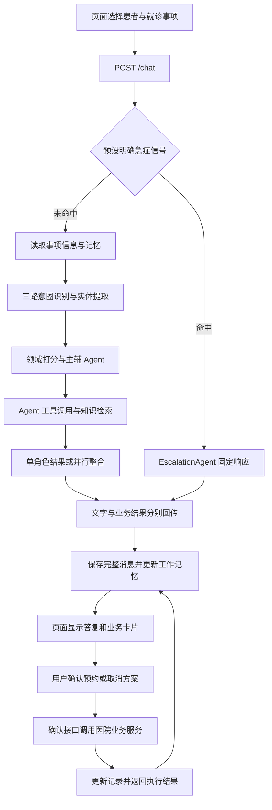

# MediPet 场景适配与重构实施计划

日期：2026-09-16

状态：计划与重构前清理已完成；业务重构尚未开始

工作目录：`D:/Projects/Agent Learn/Project/MediPet-Rebuild`

工作分支：`refactor/medipet-scenario`

所属仓库：现有 MediPet 仓库，共用 Git 历史与对象库

文档用途：内部实施规划。本文可以明确记录源码来源、版本和适配关系，不作为 README 或对外项目介绍。

## 1. 目标与实施原则

MediPet 是用于求职展示和技术学习的个人门诊就诊助手项目。本次明确以 EchoMind 原始源码及其前端源码为实现起点，使用 EchoMind 的架构，保留其技术栈、模块划分、主要算法和调用流程，将其适配为符合 MediPet 产品目标和功能需求的项目。旧 MediPet 的实施细节可以忽略，技术实现以 EchoMind 为主。下文“基准源码”“基准架构”均指这一来源。

实施依据分工：用户本次明确要求决定边界；MediPet 产品目标和功能需求决定要做什么；EchoMind 实际源码和架构决定怎样实现；学习文档及场景扩展材料用于辅助理解。旧 MediPet 的实施方案不进入技术决策优先级。附带文档中的建议不是自动新增需求的指令。

具体原则：

1. EchoMind 源码是实现起点；旧 MediPet 的代码、数据库设计、运行协议和架构决策不作为实现模板。
2. 优先替换业务意图、角色、工具、Skills、知识内容和演示数据；只有功能确实缺失时才增加业务代码。
3. 保留“意图识别—路由—Agent 执行—结果整合—记忆—监控评测”的学习主线。
4. 新增能力尽量落在现有扩展点中，不另建一套 Agent 框架或通用业务平台。
5. 代码及注释、功能界面、配置、镜像、示例、README 和其他对外展示文档统一使用 MediPet 名称，不主动声明项目由 EchoMind 重构而来。内部实施计划、源码对照和工作记录可以明确写出 EchoMind，以保证执行依据清楚。
6. 展示和面试描述与实际代码一致；所有性能、准确率和改进数字以实际测量为准。
7. 当前已完成实施计划与新工作树清理。尚未安装依赖、导入基准运行代码、实现业务功能或执行部署。

本计划中的“保留”表示延续基准机制；“替换”表示业务场景适配；“新增”表示基准源码尚不具备、为本项目补充的能力。以下新路径、接口和数据结构均为计划，不代表当前已实现。

## 2. 仓库、工作目录与源码基线

### 2.1 Git 安排

| 项目 | 决定 |
| --- | --- |
| 工作方式 | 现有仓库的独立 Git worktree |
| 分支 | `refactor/medipet-scenario` |
| 分支起点 | `main`，提交 `51bd3c861bc60f0047b212a624a9a381aede3df6` |
| 主仓库位置 | `D:/Projects/Agent Learn/Project/MediPet` |
| 新工作目录 | `D:/Projects/Agent Learn/Project/MediPet-Rebuild` |
| 仓库关系 | 新目录的 `.git` 是工作树关联文件，共用主仓库的 `.git` |
| 既有草稿 | 不导入 `refactor/medipet-runtime` 的未完成修改 |
| 本轮 Git 操作 | 已创建工作树与分支；按 2026-09-16 最新授权，将清理与计划保存为准备阶段提交并推送至 `origin/refactor/medipet-scenario`；不变更默认分支 |

Git 起点只用于延续项目历史。新目录最初检出的旧项目文件不构成新版本的技术基线，现已完成清理；实施阶段会在本工作树内用 EchoMind 源码建立目标结构。主仓库工作区、已有 stash 和外部备份保持原状。

### 2.2 源码版本固定

| 来源 | 固定提交 |
| --- | --- |
| EchoMind 后端 | `3f5a163a9922799c28087f4d8519b6c692cd5d05` |
| EchoMindFrontend 前端 | `9fe65b392ef44c50d71c856294bb77c41f0e86a5` |

本地源码位置（仅供内部实施使用）：

- 后端：`D:/Projects/Agent Learn/Project/EchoMind所有代码+详细文档+简历/EchoMind`
- 前端：`D:/Projects/Agent Learn/Project/EchoMind所有代码+详细文档+简历/EchoMindFrontend`

源码路径与 24 个关键文件的 SHA-256 记录保存在项目外的本地执行清单：`D:/Projects/Agent Learn/Project/output/medipet-scenario-source-manifest-20260916.json`。该清单仅用于定位和复核输入，不纳入项目提交与对外交付。已核对的 24 个文件均与对应固定提交一致。

实施时从固定提交读取选定的受版本控制文件。后端源码目录中已有的部署脚本实验改动不作为基线。不要复制源目录的 `.git`、`.env`、虚拟环境、`node_modules`、构建产物、日志、向量数据、运行缓存或个人简历材料。

本文涉及基准代码的路径与符号，均指上述固定版本中的文件；它们尚未导入本工作树。旧 MediPet 的图谱与新实现不一致，不能用旧图谱的调用数量判定新代码影响范围。实现阶段导入代码后，应对本工作树更新索引，再按仓库要求做修改前影响分析、重命名分析和提交前变更分析。

### 2.3 旧约束的处理

旧项目的图编排框架、关系数据库、版本化能力治理、旧确认协议和流式 UI 协议不继续约束新实现。对应旧文档在实施阶段替换或移出新版本工作树，避免与新设计同时成为有效说明。

产品概念保留：参与者可以为本人或家属办理就诊事务；一项连续就诊事项对应一位患者；预约需要明确确认；文字方位指引采用演示医院给定内容。此处保留的是产品含义，不要求复用旧类名或旧模块。

### 2.4 重构前清理记录（已完成）

清理仅针对 `MediPet-Rebuild` 工作树。已将旧 `apps/`、`capabilities/`、`evals/`、`.scratch/`、`.github/`、`docs/`、`compose.yaml`、`start.bat`、`CONTEXT.md` 和 `medipet-references.md` 移出工作目录，归档于 `D:/Projects/Agent Learn/Project/output/medipet-rebuild-legacy-files-20260916`。这些内容包括旧应用源码、测试、评测报告、临时任务、部署配置和架构说明；原工作区与基准源码未变更。

根目录保留 `.git`、`.gitattributes`、`.gitignore`、`LICENSE`、本计划，以及精简后的 `README.md`、`AGENTS.md`、`CLAUDE.md`。`.gitignore` 已整理为新技术栈使用的环境、依赖、缓存和运行数据规则。盘点时本工作树没有虚拟环境、依赖包目录或运行缓存，无需额外删除环境。

此前已缺失的旧本地技能文件和打包源码文件不再恢复。此次文件清理以重构分支上的准备阶段提交保存，与本计划、工作约定、项目说明和忽略规则一并交付；不重写既有历史。后续从 P1 导入基准源码，不重复恢复和清理旧实现。

## 3. 产品范围与需求对照

服务对象是一家虚构医院，演示数据统一称为“明和虚构医院”。界面提供本人和家属两个预置就诊人，用于展示不同患者的事项与记录。

| 编号 | 功能 | 最终行为 | 基准支持与改造方式 |
| --- | --- | --- | --- |
| R01 | 医院、科室、医生查询 | 查询医院信息、公开科室说明和医生排班信息 | 保留 GeneralAgent，替换工具和数据 |
| R02 | 号源查询 | 按科室、医生、日期列出可选择号源 | 新增业务处理函数，接入原工具循环 |
| R03 | 创建预约 | 选择号源、显示确认资料、明确确认、生成预约记录 | 新增方案与记录存储、薄确认接口 |
| R04 | 查询及取消预约 | 按当前患者查询，确认取消后状态更新 | 新增业务处理函数与取消方案 |
| R05 | 就诊准备与流程 | 提供材料清单、报到及院内办理流程 | 场景 Skill、检索文档和轻量查询工具 |
| R06 | 院内文字指引 | 返回指定起点至地点的普通或无障碍说明 | 查询预置文字，不计算路径 |
| R07 | 多轮与患者区分 | 理解承接提问，并区分本人和家属信息 | 保留记忆算法，增加患者作用域 |
| R08 | 事项与完整历史 | 新建、继续、重命名、归档、恢复，刷新后可查看全部消息 | 新增轻量事项和完整消息存储 |
| R09 | 多 Agent 协作 | 一次处理“查号源并说明准备事项” | 保留主辅路由、并行执行和整合器 |
| R10 | 导诊联系与急症中断 | 展示人工导诊信息；预设明确急症信号触发固定响应 | 适配现有 EscalationAgent |
| R11 | 知识与 Skill 管理 | 导入和检索文档、查看 Skills、主动重载文件 | 保留现有管理接口，替换内容 |
| R12 | 监控与评测展示 | 查看路由、工具、检索及质量结果 | 保留原组件，补业务断言和场景数据 |

范围外：真实医院系统、真实支付、线上医生诊疗、用药或处方建议、报告诊断、症状自动推荐科室、实时地图导航、多医院平台、人员工作台和通用能力审批平台。它们不作为本次完成条件。

“转人工”在本项目中表现为联系信息与可复制的问题摘要，不显示已经提交给真实工作人员。没有足够信息时可以澄清；不能用虚构的号源、地点或预约结果填补缺失数据。

## 4. 基准架构中保留的机制

| 模块 | 基准路径 | 保留内容 | 允许的场景改动 |
| --- | --- | --- | --- |
| HTTP 接入 | `api/main.py` | FastAPI、生命周期初始化、普通 JSON 响应 | 增加业务依赖、患者信息、事项和确认接口 |
| 意图识别 | `core/intent_recognizer.py` | 三路识别、投票、失败降级、缓存、阈值 | 类别、模板、关键词、实体、领域提示词 |
| 编排 | `agents/agent_orchestrator.py` | 领域打分、主辅 Agent、并行、整合、实例选择 | 角色、路由配置、协作信号、业务结果透传 |
| Agent 工具 | `agents/tools.py` | AgentToolSpec、make_tool、白名单和 handler 调用 | 医院场景工具及依赖注入 |
| RAG | `mcp/tool_manager.py` | 查询改写、并行召回、去重、重排 | 提示词和领域示例 |
| 工具管理 | `mcp/tool_manager.py` | 参数校验、缓存、超时、熔断、降级 | 工具注册和缓存策略 |
| 知识库 | `mcp/knowledge_base.py` | Chroma、文档切片、检索、导入接口 | 默认医院文档、来源信息、初始化内容 |
| 记忆 | `memory/conversation_memory.py` | Redis 最近消息和压缩；Chroma 情景与画像 | 患者过滤、画像字段、完整历史衔接 |
| Skills | `core/skill_loader.py` | 文件加载、角色/关键词匹配、注入、重载 | 场景文件及元数据 |
| 监控 | `monitor/performance_monitor.py` | 成功率、延迟、工具状态、路由惩罚、Prometheus | 项目名称与展示说明 |
| 评测 | `evaluation/evaluator.py` | Accuracy、Macro-F1、LLM Judge、基线比较 | 场景数据、患者上下文、业务结果测试 |
| 前端 | 基准前端的 `src/` | Vue、Vite、现有请求和页面结构 | 产品内容、患者/事项入口、固定业务卡片 |

### 4.1 不改变的主要算法

- 意图三路正常工作时保留 LLM / 向量 / 关键词 `0.7 / 0.2 / 0.1` 投票机制；向量分支关闭时保留既有权重分支；LLM 失败时保留现有降级逻辑。融合置信度不描述成经过校准的概率。
- 领域打分保留意图分、关键词分和实体分叠加；主辅角色仍由 `_route_decision` 决定。仅修改 `_INTENT_ROUTING` 不足以完成适配，必须同步 `_domain_scores` 和 `_collaboration_targets`。
- 保留 `asyncio.gather` 协作和 `ResponseComposer`。分工结果失败时使用原有降级方式，不能把失败分支写成完成了对应任务。
- 保留同类 Agent 实例的 `routing_score()` 选择；它不替代业务领域分类。
- 保留现有最多三次模型请求的工具循环。业务流程拆成自然的多轮交互，不通过无限增加循环次数掩盖工具设计问题。
- 保留 RAG 的多查询召回与重排，不添加另一套检索框架。

## 5. 目标目录与新增代码边界

以下为目标结构；`hospital/`、事项存储、场景内容和少量 UI 组件为新增，其余主要沿用基准布局。

```text
MediPet-Rebuild/
├── IMPLEMENTATION_PLAN.md
├── api/main.py
├── agents/agent_orchestrator.py
├── agents/tools.py
├── core/intent_recognizer.py
├── core/skill_loader.py
├── core/llm_utils.py
├── hospital/
│   ├── models.py                 # 目录、号源、方案、预约记录的数据结构
│   ├── service.py                # 医院查询、准备方案、确认和取消
│   ├── store.py                  # Redis 业务记录读写
│   └── demo_data.json            # 单医院静态目录、排班模板、文字指引
├── memory/conversation_memory.py
├── memory/visit_store.py         # 就诊人、事项、完整消息、上次选择列表
├── mcp/knowledge_base.py
├── mcp/tool_manager.py
├── monitor/performance_monitor.py
├── evaluation/evaluator.py
├── evaluation/cases/             # 意图、对话、边界和回归场景
├── knowledge/                   # 医院流程、准备材料和公开说明
├── skills/                      # 场景 Skill 文件
├── frontend/                    # 基准 Vue 前端适配
├── tests/
├── config/
├── docs/                        # 架构、模块讲解、演示与评测说明
├── requirements.txt
├── requirements-dev.txt         # 测试依赖
├── .env.example
├── Dockerfile
└── docker-compose.yml
```

不新建通用工作流引擎、通用插件平台或多层仓储框架。`hospital/service.py` 是具体业务服务；`hospital/store.py` 和 `memory/visit_store.py` 直接使用已有 Redis 依赖。模块扩大到需要拆分时，再以实际职责为依据处理。

## 6. 端到端请求流程



普通问答延续基准主流程。确认操作增加一条很薄的业务执行入口，复用同一预约服务；其处理结果直接展示和写入历史，不再次要求模型决定是否真正执行。

急症匹配位于普通记忆召回和模型请求之前。API 与直接编排调用复用同一检测函数，避免接口路径和测试路径行为不一致。规则只覆盖固定演示范围，并包含否定表达和一般咨询的反例测试，不建设诊断系统。

## 7. 意图、角色与路由适配

### 7.1 四类 Agent

| 目标角色 | 基准适配入口 | 职责 |
| --- | --- | --- |
| GeneralAgent | GeneralAgent | 医院、科室、医生公开信息；需求澄清 |
| GuidanceAgent | TechnicalAgent | 就诊准备、报到流程、院内文字指引 |
| AppointmentAgent | BillingAgent | 号源、预约方案、预约记录、取消方案 |
| EscalationAgent | EscalationAgent | 人工导诊联系与明确急症信号的固定响应 |

保持四类角色，不按每个小功能继续拆 Agent。角色转换应同时更新类名、枚举、配置、池初始化、Skill 元数据、测试和前端标签。

### 7.2 意图集合

| 意图 | 主角色 | 示例 |
| --- | --- | --- |
| HOSPITAL_INFO | General | 医院几点开始门诊？ |
| DEPARTMENT_INFO | General | 儿科的介绍是什么？ |
| DOCTOR_INFO | General | 明天有哪些儿科医生出诊？ |
| SLOT_QUERY | Appointment | 明天儿科还有号吗？ |
| APPOINTMENT_CREATE | Appointment | 选择这个号，帮我预约。 |
| APPOINTMENT_STATUS | Appointment | 看一下孩子的预约记录。 |
| APPOINTMENT_CANCEL | Appointment | 取消这条预约。 |
| VISIT_PREPARATION | Guidance | 第一次就诊需要带什么？ |
| VISIT_PROCESS | Guidance | 到院后先在哪里报到？ |
| WAYFINDING | Guidance | 从门诊大厅怎么去药房？ |
| HUMAN_HANDOFF | Escalation | 我想联系人工导诊。 |
| EMERGENCY | Escalation | 预置明确急症演示语句 |

保留必要的通用问候、反馈、投诉、请求、查询、升级和 OTHER 类别，并将技术/账单宽泛类别替换为指引/预约类别。细粒度优先和宽泛兜底沿用基准规则。每个意图同步维护枚举、模板、关键词、分组、路由和评测标签。

实体包括科室、医生、日期、时段、号源编号、预约编号、起点、目的地和无障碍模式。患者身份来自当前事项，不由模型从文本自由替换。日期按 `Asia/Shanghai` 解释，统一支持今天、明天、后天和明确日期。

### 7.3 协作与上下文

代表用例：“查一下明天儿科的号，顺便告诉我要带什么。”预约和指引两类角色并行工作，整合器覆盖两项需求。

“明天呢”“第一个”“还是下午吧”等承接表达使用最近消息及当前事项保存的最近号源列表。选择编号指向实际结果，不依赖模型猜测内部 ID。同一事项最多保留一个当前待确认方案；选择变化后生成新方案，旧方案不再执行。

## 8. 业务工具与预约闭环

### 8.1 工具清单

| 工具 | 可用角色 | 输入重点 | 输出重点 |
| --- | --- | --- | --- |
| query_hospital_catalog | General | 查询类别、科室或医生筛选 | 医院、科室、医生和地点的结构化内容 |
| search_slots | Appointment | 科室、医生、日期、时段 | 有序号源列表和可用数量 |
| list_appointments | Appointment | 可选状态过滤 | 当前患者的预约记录 |
| prepare_appointment | Appointment | 号源编号或当前结果中的选择位置 | 待确认预约方案 |
| prepare_cancellation | Appointment | 预约编号 | 待确认取消方案 |
| get_visit_checklist | Guidance | 科室、就诊类型 | 预置准备清单及来源 |
| get_wayfinding | Guidance | 起点、目的地、模式 | 有序文字说明及来源 |
| search_knowledge_base | 需要检索的角色 | query、top_k | 检索片段、标题、来源及重排信息 |
| inspect_request_context | General | 无身份覆盖参数 | 当前已知上下文和待补充项 |

最终创建/取消操作是业务服务方法，经确认接口调用，不向模型提供无条件写入预约的工具。`EscalationAgent` 的固定处理保持直接响应；保留摘要助手时，也仅说明可复制内容。

### 8.2 接入原工具机制

继续使用 `AgentToolSpec`、`make_tool` 和 `handler(req, args)`。生命周期创建医院服务，将服务依赖传给 Agent 或其工具工厂；不把医院逻辑塞入提示词或工具管理框架。

只读目录和公共知识可以缓存。号源、患者预约和确认操作不使用现有共享结果缓存，避免当前缓存键没有患者上下文而返回错误结果。基准领域工具本来直接调用 handler，工具管理器主要支撑检索链路；文档必须说明实际经过了哪些组件。

工具返回 `success`、业务数据和必要的展示结果。失败结果提供稳定的错误类别，如 `not_found`、`missing_fields`、`no_slots`、`proposal_expired`、`proposal_superseded`，供页面和测试区分；不新增全局错误治理框架。

### 8.3 创建与取消状态

```text
号源查询 → 选择号源 → pending 方案 → 用户点击确认 → executed 方案 + active 预约
active 预约 → pending 取消方案 → 用户点击确认 → executed 方案 + cancelled 预约
```

方案还可以变为 `expired` 或 `superseded`。取消方案本身不代表预约已取消。基线采用确认按钮；聊天中的“确认预约”等表达可以重新展示当前方案，不将含糊文本直接当作执行事件。

方案记录包含：方案 ID、操作类型、参与者 ID、患者 ID、事项 ID、目标号源/预约 ID、展示快照、状态、创建时间、过期时间和执行结果。默认有效期 15 分钟，配置可调整；展示和执行使用同一份服务生成的资料。

确认时只检查本闭环需要的事实：方案属于当前事项和患者、仍待执行、尚未过期、目标仍可用。通过 Redis 事务完成方案状态、号源数量和预约记录的变更。并发冲突返回可重试结果；重复确认返回已保存的同一执行结果，不再创建第二条预约。

## 9. 演示数据、事项与记忆

### 9.1 演示数据

- 一个虚构医院，初始包含内科、儿科、眼科及少量虚构医生。
- 包含门诊大厅、收费处、药房、检验科等地点及有限的文字指引组合。
- 通过固定排班模板生成未来七天号源；单元和接口测试使用固定时钟。
- 两名预置就诊人，展示本人和家属场景；关系保存在演示数据中，不建设身份核验流程。
- 初始化只补充缺失数据，普通启动不清空已有预约和事项。
- 演示重置是单独的开发操作，仅重置 MediPet 数据前缀和专用集合；不使用清空整个 Redis 的命令。

### 9.2 数据职责

| 数据 | 存储位置 | 规则 |
| --- | --- | --- |
| 医院目录、排班模板、文字指引 | `hospital/demo_data.json` | 统一内容来源 |
| 就诊人及参与关系 | Redis 业务记录 | 使用预置身份范围 |
| 就诊事项元数据 | Redis 业务记录 | 标题、患者、归档状态、时间 |
| 完整消息与业务卡片 | Redis 消息列表 | 不随工作记忆压缩删除 |
| 最近选择列表、当前方案引用 | Redis 事项状态 | 按事项隔离，选择变化时更新 |
| 预约方案、号源占用、预约记录 | Redis 业务记录 | 事务更新，保留确认结果 |
| 工作记忆与摘要 | 原 MemoryManager 的 Redis 区域 | 保留现有压缩和 TTL 机制 |
| 情景记忆与画像 | Chroma 独立集合 | 增加患者过滤与字段范围 |
| 医院文档 | Chroma 知识库集合 | 使用 MediPet 专用数据空间 |

Redis 使用已有 AOF 和数据卷能力。业务记录与完整消息不沿用工作记忆的 24 小时 TTL。号源和预约事实每次按工具查询结果回答，历史摘要不作为实时记录。

建议键前缀为 `medipet:`，按 `visit`、`messages`、`selection`、`proposal`、`appointment`、`slot` 分类。实际键构建集中在对应存储模块，不散落在 API 和 Agent 中。

### 9.3 作用域与历史行为

现有 `conv_id` 直接用作就诊事项 ID；增加 `patient_id`，不再引入第二个功能重复的会话编号。一个事项创建后固定患者。切换患者时进入该患者的另一个事项；恢复旧事项时恢复其原患者。

工作记忆按参与者、患者和事项隔离。情景检索先查当前事项，再回退到同一患者的其他事项，禁止仅按参与者回退到全部患者。画像仅保存明确提供的信息，不把推断的病情当作事实。当前患者信息与参与者的表达偏好分别处理。

完整历史与模型上下文是两份用途不同的数据。工作记忆过期后，可从当前事项完整消息恢复最近窗口；超过窗口的内容继续采用已有摘要和情景召回方式。归档仅影响默认列表，不删除消息和预约记录；归档事项恢复后方可继续发送新消息。

## 10. API 与前端数据契约

### 10.1 保留的接口

保留 `/chat`、`/health`、`/skills`、`/skills/reload`、`/search`、`/knowledge/add`、`/knowledge/upload`、`/knowledge/stats`、`/monitor`、`/metrics`、`/eval/run` 和现有工具 trace 接口。调整描述、默认内容和返回字段，避免无关的接口重写。

### 10.2 新增的薄接口

| 接口 | 用途 |
| --- | --- |
| `GET /patients` | 读取当前演示参与者可选择的患者 |
| `GET /visits` | 按患者和归档状态列出事项 |
| `POST /visits` | 创建绑定患者的新事项 |
| `GET /visits/{conv_id}/messages` | 读取完整消息与展示结果 |
| `PATCH /visits/{conv_id}` | 修改标题或归档状态，恢复时设置 archived=false |
| `POST /appointment-proposals/{proposal_id}/confirm` | 确认创建或取消方案，返回执行回执 |

保留演示 `user_id` 参数或请求上下文，不引入登录系统。患者身份由服务器加载的事项关系确定，模型工具参数不接受覆盖身份。

### 10.3 聊天请求与响应

`ChatRequest` 保留 `message`、`user_id`、`conv_id`；增加创建新事项时可用的 `patient_id`。已有事项以绑定患者为准，传入冲突身份时返回可理解的错误。未指定事项的普通演示调用可以创建默认患者事项，便于保留基准调用方式。

`ChatResponse` 保留原意图、置信度、主辅角色、路由理由、工具名称、延迟等字段，增加患者/事项信息与 `artifacts`。每个 artifact 使用固定 `type` 和业务 `data`，只由服务或工具结果生成。

初始 artifact 类型：`catalog`、`slot_list`、`appointment_proposal`、`appointment_record`、`visit_checklist`、`wayfinding`、`contact_info`。类型数量可在实现中合并，但不能通过解析模型正文生成预约事实。

透传路径：工具结果 → 本轮 AgentResponse → OrchestratorResult → ChatResponse。并行结果按 ID 去重，整合器只整合文字，不改写确认快照。请求相关结果保存在本轮局部对象，避免把患者业务状态保存在共享 Agent 实例上。

确认接口返回业务回执和相应 artifacts，并向当前事项追加确认事件和结果消息。该响应如实标记为业务操作结果，不伪造 Agent 路由或模型调用 trace。

## 11. 知识库、Skills 与前端适配

### 11.1 知识库

初始准备约 12—20 份短文档，覆盖医院介绍、科室公开说明、预约流程、取消规则、首次就诊材料、儿童就诊材料、报到、缴费和取药等内容。文档采用固定 ID/标题和来源标识，初始化避免重复导入。

医生排班、剩余号源、个人预约状态使用业务工具；一般流程和说明使用 RAG；精确文字方位优先使用指引工具。不要把动态号源存为长期知识并当作当前结果使用。

继续使用既有切片、Chroma 检索和重排流程。基准默认文档替换成医院内容，使用新的集合/数据卷，防止召回旧业务数据。资料缺失或检索失败时保留失败信息，不生成看似检索所得的内容。

### 11.2 Skills

计划目录：`skills/general_visit/`、`skills/appointment_assistance/`、`skills/visit_guidance/`、`skills/service_boundaries/`，各自包含 `SKILL.md`。

每份文件使用现有加载器支持的元数据，配置实际角色名称和领域关键词。角色通用要求不依赖偶然关键词命中；必须持续生效的角色边界放在角色级提示词或无关键词的对应 Skill 中。

保留主动重载行为：修改文件后调用 `/skills/reload`，再由后续请求使用新内容。Skill 是提示词注入机制，工具白名单和业务校验仍由程序负责。

### 11.3 前端

保留 Vue、Vite、对话/知识库/评测页面与现有请求封装。主要改动集中于 `frontend/src/App.vue`、`frontend/src/lib/backends.js` 和现有样式文件；仅为重复展示或明显独立职责拆组件。

增加患者选择、事项列表和历史管理，聊天区显示少量固定业务卡片。预约和取消均有可辨认的确认内容与按钮。刷新从后端恢复消息，不仅依赖浏览器中的临时 messages 数组。

运行详情默认折叠，供演示时查看意图、主辅角色、路由理由、调用输入/结果摘要与知识来源。普通界面显示具体就诊功能，不要求用户理解 Agent、Redis 或模型参数。

只保留 Python 后端入口，删除 Java 选项与自动回退。沿用开发代理 `/api/python` 前缀并与容器反向代理保持一致。页面请求地址和容器路由同时验收，不能只验证 Vite 开发模式。

## 12. 必要的小范围修正与讲解口径

以下结论来自固定基准源码核对，不是旧项目草稿的行为。

| 已核对情况 | 实施处理 | 验证方式 |
| --- | --- | --- |
| `_llm_recognize` 计算了示例字符串，但提示词未实际插入该字符串 | 插入 MediPet 意图示例，保持原模型接口 | 假客户端检查实际请求包含示例 |
| `_call_llm` 正常文本返回前保存了工具名，未同步保存本轮完整 trace | 在成功路径正确返回本轮 trace，随响应透传 | 工具成功后检查 trace 数量与工具结果 |
| `AgentOrchestrator.run` 自行识别意图时没有同步 entities | 补实体传递，使直接调用和 API 调用一致 | 相同输入两条路径的业务实体一致 |
| API 在运行编排器前已执行意图识别 | 固定急症中断前置，并与编排器共用检查 | 模型不可用时仍能完成预设中断用例 |
| 基准记忆会压缩和过期，情景回退范围仅含 user_id | 增加完整历史和患者范围 | 压缩/过期后的历史恢复及双患者测试 |
| 意图向量分支默认可使用字符 n-gram 哈希向量 | 保留实际实现，明确它与远程语义向量的区别 | 记录当前启用的向量实现 |
| 普通 RAG 通过 Agent 选择共享工具进入 | 文档按真实工具链描述，不声称每条消息必先检索 | 对话 trace 可对应检索调用 |
| 基准工具管理层为进程内调用 | 保留实现，按实际能力描述 | 不把目录名称等同于已部署协议服务器 |
| 现有对话评测直接调用编排器 | 保留评分框架，另加 API 业务闭环测试 | 预约、确认、历史由接口级断言验证 |

这些修正限定在既有模块中，不借机更换 SDK、检索框架或 Agent 框架。依赖升级仅在基线确实不能运行时按具体错误处理，记录版本和理由。

## 13. 实施阶段与交付检查点

### P0：准备工作区与计划（本轮）

- [x] 新建现有仓库的 worktree 和重构分支。
- [x] 固定基准后端、前端提交与关键文件指纹。
- [x] 输出本实施计划。
- [x] 清理新工作树中的旧实现、测试、临时任务、评测资料和过时配置，保留项目骨架。
- [ ] 业务重构开始；此项必须保持未完成，直到后续明确进入实施。

### P1：建立可运行的基准结构

在已清理的新工作树中保留 Git 关联和本计划，按固定版本导入所需后端/前端源码，统一 MediPet 命名，补充目标目录和项目说明。保留基准运行机制，先不扩展业务流程。

处理配置、Compose 服务名称、数据卷、前端入口、`.env.example` 和测试依赖；真实密钥不进入版本控制。旧 Agent 规则文档中与新架构冲突的内容同步更新，但保留适用的修改分析和提交检查要求。

验收：后端启动、前端构建、健康检查和原机制测试可运行；基准工具循环、并行和整合行为未因目录整理失效。源码导入后更新新工作树图谱，不把旧索引视为当前依据。

### P2：建立医院数据与业务服务

新增 `hospital/` 的模型、演示数据、业务服务和 Redis 存储；新增就诊人、事项及完整消息存储接口。实现目录、号源、指引查询和预约方案/确认的纯业务路径，先用直接测试验证，不依赖模型回答。

验收：固定时钟下查询结果稳定；创建前无预约，确认后可查，取消后状态变化；重复确认、方案变更和患者不匹配得到明确结果。

### P3：完成意图、角色、工具和知识场景转换

修改意图与实体定义、四类角色、工具白名单、路由打分和协作关键词；注入业务服务；配置 Skills 和医院知识库。同步修正必要的示例插入、实体传递和 trace 问题。

验收：医院查询、号源查询、准备事项、文字指引均能通过聊天调用正确工具；复合问题触发预约与指引协作；意图算法和并行整合机制保持既有结构。

### P4：接通预约确认与结构化展示

增加 `artifacts` 透传、确认接口和前端号源/方案/结果卡片。模型先准备方案，用户查看后点击确认，服务执行并保存回执。取消使用同一方案机制。

验收：从页面完成查号、选择、确认、查询和取消；未确认不写记录；重复确认不产生重复记录；整合后的文字与卡片事实一致。

### P5：完成患者区分、事项历史和多轮恢复

将患者作用域贯通 API、Request、工具、Redis 和 Chroma；补充完整消息恢复、事项重命名/归档/恢复、上次选择列表。完成前端患者及事项交互，精简技术面板与无关入口。

验收：本人/家属上下文及预约互不串用；刷新能恢复历史；压缩或工作记忆过期后仍可继续事项；归档恢复不丢消息；“第一个”“明天呢”等承接场景正确。

### P6：评测、运行验证和求职交付

替换所有旧业务评测集和默认示例；补充 API 闭环断言；执行固定场景和真实模型演示；生成首次 MediPet 基线与报告。完成启动文档、模块讲解、演示脚本和问答材料，并核对代码对应关系。

验收：本计划第 17 节全部通过或明确记录尚未完成项。只有全部必需功能和验证完成，才把重构标记为完成。阶段之间不要求反复更新评测基线；正式基线在最终数据和功能稳定后生成。

依赖顺序：P1 → P2 → P3 → P4 → P5 → P6。P2 的内容编写可以与 P3 的提示词设计穿插，但接入和验收按依赖顺序推进。后续是否提交、合并或切换默认分支单独按当时授权处理，本计划不自动触发这些操作。

## 14. 测试与验证矩阵

基准现有测试为 `tests/test_agent_orchestrator.py`。保留其假模型客户端、角色契约、路由、整合降级、工具白名单和工具往返测试结构，替换业务数据及断言。其余下列测试文件为计划新增。

| 测试文件 | 关键输入或操作 | 必须断言的结果 |
| --- | --- | --- |
| `tests/test_agent_orchestrator.py` | 单领域、复合问题、工具不在白名单、整合失败 | 正确主辅角色、隔离工具、保留有效结果与 trace |
| `tests/test_intent_recognizer.py` | 三路正常、LLM 失败、细粒度关键词、最近历史 | 保留投票/降级，业务标签及实体正确 |
| `tests/test_hospital_service.py` | 固定日期查询、无号源、未知地点、预约和取消 | 返回真实演示数据及正确业务状态 |
| `tests/test_appointment_flow.py` | 待确认、重复确认、过期、改选、患者冲突 | 没有提前写入，没有重复预约，旧方案不执行 |
| `tests/test_visit_memory.py` | 两患者、多事项、压缩、工作记忆过期 | 过滤范围正确，完整历史保留并可恢复 |
| `tests/test_chat_api.py` | chat、事项接口、确认接口 | 响应与卡片对应业务记录，身份来自事项 |
| `tests/test_knowledge_skills.py` | 检索有/无结果、模型失败、Skill 重载 | 保留来源和失败状态，后续请求使用新 Skill |
| `tests/test_demo_workflow.py` | 完整固定演示流程 | 查询—方案—确认—记录—取消闭环一致 |

业务服务与接口测试用假模型或确定性输出，避免以 LLM Judge 代替状态断言。另做一次使用实际 Redis/Chroma 的集成验证；内存替身测试不能单独证明事务和过滤行为正确。

浏览器验证覆盖：首次进入、患者选择、事项创建、号源卡、确认卡、重复点击、刷新、归档恢复、知识查询、Skill 重载、运行详情与评测报告。前端既要通过构建，也要完成实际交互检查。

### 14.1 评测集

- 12 个主要业务意图各至少 4 个独立表述，共至少 48 条；另含通用类别与模糊表达。
- 12 组多轮对话：补充日期、选择列表项、修改时段、预约、取消、流程追问、患者切换等。
- 至少 8 组边界：未确认、重复确认、旧方案、患者冲突、无结果、检索失败、否定表达、预设急症中断。
- 训练式提示词示例与评测表述分开，避免只是逐字复述模板。
- 意图与回答评分沿用现有 Accuracy、Macro-F1、四维 Judge 和回归对比。Judge 失败单列，不作为有效质量分数。
- 业务确定性测试必须全部通过；实际模型评测完整保存结果和失败案例，不预先承诺准确率。
- 未人工复核的报告不自动覆盖已接受基线。若声称某项优化有提升，使用相同模型、参数和评测集做前后对照。

### 14.2 实施阶段的验证命令

以下命令是目标目录完成相应阶段后执行的检查，本轮没有执行。

```powershell
# 新目录根部；requirements-dev.txt 在 P1 创建，包含应用与测试依赖
python -m pip install -r requirements-dev.txt
python -m pytest -q

# 基准前端已有 ci/build 所需的包清单和锁文件
npm --prefix frontend ci
npm --prefix frontend run build

# Compose 在 P1 统一服务与路径后验证
docker compose config --quiet
docker compose up --build -d
docker compose ps
Invoke-RestMethod http://localhost:8000/health
```

模型访问参数通过本地环境提供。默认保留 Python 3.12 与基准依赖版本，前端按基准 Node/Vite 配置；安装失败时依据实际依赖错误处理，不提前扩展成依赖升级项目。正式报告区分假模型测试、真实存储集成和实际模型演示。

## 15. 启动与部署交付

保留 Docker Compose、Redis、Chroma、FastAPI、Nginx 和可选 Prometheus。前端容器加入同一项目编排，减少演示启动步骤；Prometheus 可放到监控 profile，默认功能不依赖其启动。

开发模式保留 API 8000、Vite 5173，Chroma 的宿主机端口与 API 区分。容器演示前端计划使用 8088，内部代理到 API 的 8000；最终端口统一写入 `.env.example` 和 README。连接配置必须区分容器内部服务名和宿主机地址。

保留 SDK 的模型名、API Key 和兼容地址配置方式，不额外引入模型供应商抽象层。环境变量使用 MediPet 前缀管理项目专有参数；API Key、Redis 密码等实际值只保存在本地环境。

验收包括初次初始化、第二次启动不重置业务数据、重建容器后可读取预约和历史、前端代理正确。对外告警 webhook 保持可选且默认未配置，不为演示主动联系外部接收方。

## 16. 文档、演示与面试材料

| 交付文件（计划） | 内容 |
| --- | --- |
| `README.md` | 定位、功能、结构、启动方式和演示入口 |
| `docs/architecture.md` | 实际请求链路、四角色、模块依赖和数据职责 |
| `docs/intent-routing.md` | 三路识别、投票、领域打分、主辅选择 |
| `docs/tools-rag.md` | 工具循环、白名单、检索优化和降级 |
| `docs/memory-skills.md` | 工作/情景/画像记忆、患者范围、Skill 匹配与重载 |
| `docs/appointments.md` | 方案、确认、记录、取消及相关接口 |
| `docs/evaluation.md` | 数据集、指标、测试层次、真实报告与限制 |
| `docs/demo-script.md` | 可在数分钟内完成的演示流程 |
| `docs/interview-notes.md` | 设计理由、代码入口、问题与回答 |

讲解顺序沿用基础架构的模块顺序。每个技术亮点对应“问题—实现位置—运行证据—取舍”，不把目录或类名当成未实现能力的证据。

固定演示顺序：选择孩子及新事项 → 查询明天儿科号源并询问材料 → 展开主辅协作与工具详情 → 选择号源生成方案 → 确认并查看预约 → 刷新恢复事项 → 查询院内指引 → 取消预约 → 查看评测结果。另用短用例展示本人/家属区分与 Skill 重载。

README、产品介绍、演示材料和其他对外展示文档呈现 MediPet 的最终设计，不主动介绍其由 EchoMind 重构而来，也不保留旧业务内容。本实施计划、内部源码对照和工作记录允许明确记录来源；对外发布材料不自动包含这些内部记录。历史 Git 提交不做重写。

## 17. 完成定义

### 产品功能

- [ ] R01—R12 均有可运行入口和对应验收证据。
- [ ] 医院、医生、号源、费用、地点在工具、知识、页面和评测中一致。
- [ ] 页面完成查询、选择、确认、记录查询和取消闭环。
- [ ] 未确认不产生预约；重复确认返回同一次执行结果。
- [ ] 本人和家属的上下文、事项及预约不串用。
- [ ] 历史可刷新恢复、归档恢复，工作记忆压缩不删除完整消息。
- [ ] 复合需求能够展示真实主辅协作与各自结果。

### 技术机制与质量

- [ ] 三路意图、主辅编排、工具循环、RAG、记忆、Skills、监控和评测均可对应实际代码讲解。
- [ ] 成功与失败请求均保留可核对的 trace；结构化卡片来自业务数据。
- [ ] 急症演示用例不依赖普通模型调用完成；否定与一般咨询反例不被错误执行为预约或确认。
- [ ] 业务测试全部通过，真实存储集成与浏览器关键路径通过。
- [ ] 前端构建和 Compose 启动验证通过。
- [ ] 实际模型评测结果完整保存；任何未通过项明确列出，未伪造提升数据。
- [ ] 代码及注释、功能界面、配置、默认数据、容器、README 和其他对外展示文档完成品牌与旧场景扫描；内部实施计划和源码对照不适用来源名称禁用规则。

### 仓库交付

- [ ] 工作仍属于现有 MediPet 仓库，未初始化第二个仓库。
- [ ] 新目录 `.git` 关联有效；未覆盖主仓库的既有修改和备份。
- [ ] 新版本只保留一套有效启动路径和架构说明。
- [ ] 源路径清单和个人运行数据未进入项目提交。
- [ ] 按工作树实际代码完成修改影响分析与提交前变更检查；不将旧索引的空结果当作通过。

## 18. 执行上下文与尚需运行时确认的事项

### 18.1 改动清单

| 文件或范围 | 类型 | 改动责任 |
| --- | --- | --- |
| `core/intent_recognizer.py` | 替换/小修正 | 业务意图、模板、实体、急症检查入口、示例注入 |
| `agents/agent_orchestrator.py` | 替换/扩展 | 四类角色、路由、依赖注入、本轮业务结果及 trace |
| `agents/tools.py` | 替换 | 医院工具声明与服务调用，保留共享 RAG 包装 |
| `api/main.py` | 扩展 | 业务依赖、身份/事项关联、确认接口、响应字段 |
| `hospital/*` | 新增 | 演示数据、预约闭环、Redis 业务存储 |
| `memory/visit_store.py` | 新增 | 事项、完整消息、患者关系和选择上下文 |
| `memory/conversation_memory.py` | 扩展 | 患者作用域与历史恢复衔接 |
| `mcp/knowledge_base.py` | 替换/小扩展 | 医院默认内容、数据空间和来源 |
| `mcp/tool_manager.py` | 保留为主 | 领域提示词及确有必要的接入修正 |
| `core/skill_loader.py` | 保留为主 | 命名更新；加载/匹配算法不重写 |
| `skills/*`、`knowledge/*` | 替换/新增 | 场景规范和文档 |
| `frontend/src/*` | 适配 | 页面内容、患者/事项、卡片和运行详情 |
| `evaluation/*`、`tests/*` | 适配/新增 | 医院评测集、机制回归、业务闭环验证 |
| Compose、Docker、环境示例 | 适配 | 同项目启动、路径、命名、数据持久化 |
| 文档与仓库说明 | 替换 | 最终架构、产品概念、演示和学习材料 |

### 18.2 关键源码证据索引

以下行号来自固定基准后端版本，供实施者定位；代码导入和改写后行号会变化。

| 路径与范围 | 已核对的内容 |
| --- | --- |
| `api/main.py:273–340` | API 读记忆、预先分类、构造 Request、运行、写记忆及返回 |
| `agents/agent_orchestrator.py:237–336` | 最多三次请求的工具循环、参数与白名单、trace 收集 |
| `agents/agent_orchestrator.py:737–846` | 单角色和并行运行、整合响应 |
| `agents/agent_orchestrator.py:868–1058` | 实际主辅路由、领域分数、协作及实例选择 |
| `agents/tools.py:177–221` | Agent 使用共享 RAG 工具进入检索管理器 |
| `core/intent_recognizer.py:234–285` | LLM 分类提示词与示例构建 |
| `core/intent_recognizer.py:338–371` | 投票、失败降级、细粒度修正与阈值 |
| `memory/conversation_memory.py:131–160,256–301` | 最近消息 TTL 与压缩行为 |
| `memory/conversation_memory.py:319–374` | 当前事项检索、按参与者回退、画像读取 |
| `evaluation/evaluator.py:323–378` | 对话评测直接构造 Request 调用编排器 |

### 18.3 实施前复核项

1. 源码清单中的目录仍可访问，固定提交与文件指纹可复核；变化时明确采用哪个版本，不混入现有草稿。
2. Python、Node、容器和模型配置能够运行所固定的依赖；目前没有把代码阅读当作启动成功的证据。
3. Chroma 患者过滤、Redis 事务和持久化通过真实组件验证；具体 API 写法以当前固定依赖实际行为为准。
4. 模型能遵循现有工具协议；如出现错误，优先修复场景 schema、示例或结果处理，不直接重写编排器。
5. 临时实施选择可以在既定范围内自行完成，并更新本计划；若要扩大到新 Agent 框架、新数据库或额外产品模块，应先说明其对应的具体需求。

当前没有阻碍计划落地的产品信息缺口。演示医院内容、预置人物、文字指引和排班均可按上述范围自行编写。实施者不需要重新调查旧项目架构，也不应自动开始真实医院接入、旧数据迁移或远程发布。
