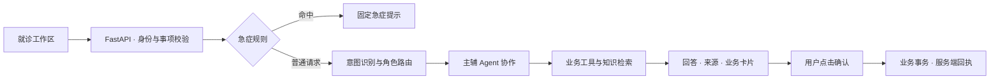

# MediPet

[](LICENSE)


MediPet 是面向医院、诊所及健康服务平台就诊服务场景的多 Agent 助手。用户为本人或家属建立独立事项后，可以查询医院与号源、准备就诊材料、确认或取消预约，也可以获取初步分诊信息、查询已收录药品标签、上传报告并核对原文数值。

项目使用 Python/FastAPI、Vue/Vite、Redis 和 Chroma，结合领域知识库、分层记忆、动态 Skills、运行监控与评测组织服务链路。模型负责理解请求、选择工具和组织回答；患者归属、号源库存、预约状态和幂等回执由业务服务校验。

## 目录

- [功能概览](#功能概览)
- [架构设计](#架构设计)
- [快速开始](#快速开始)
- [项目结构与文档](#项目结构与文档)
- [测试与评测](#测试与评测)
- [许可证](#许可证)

## 功能概览

| 功能 | 页面上的结果 |
| --- | --- |
| 医院、科室、医生与号源查询 | 目录、可选号源及资料来源 |
| 创建和取消预约 | 先核对方案，再点击卡片确认，取得服务端办理回执 |
| 就诊准备与院内指引 | 材料清单、报到步骤、普通或无障碍文字路线 |
| 症状与科室方向 | 有来源的初步方向、缺失信息和就医提示 |
| 药品标签信息 | 已收录药品的用途、用法用量、禁忌和相互作用警示 |
| 报告文字、PDF 与图片 | 本地提取原文、整理项目和参考范围，同一事项可继续追问 |
| 本人与家属事项 | 独立记录、事项重命名、归档、恢复和完整历史 |
| 知识与 Skills | 检索或导入公开资料，查看并主动重载场景规则 |
| 运行与评测 | 查看工具轨迹、来源、运行统计、失败样本和候选报告 |

首页以就诊操作为主，患者、事项、消息、报告上传和预约卡片保持在同一工作区。知识库、Skills、监控、评测和 API 文档位于“管理与调试”入口，进入对应页面时才读取管理数据；进入评测页不会自动调用模型。

预约方案不会预占库存，聊天中的“确认”不会执行预约；只有卡片按钮会调用确认接口。若确认请求中断，页面会暂停重复提交，并通过完整历史核对服务端回执。人工导诊只提供联系资料，不向工作人员发送消息。

项目不接入真实医院，不替代医生诊断、不开处方、不评价其他医院或医生的诊疗方案，也不提供支付或实时地图导航。药品范围和报告边界见[健康咨询说明](docs/health-consultation.md)：当前药品资料仅覆盖两个指定公开标签，未知药物、剂型或组合不能据此判断安全；报告原件不保留，提取文字和卡片保存在所选患者的当前事项。

## 架构设计

| 能力 | 实现方式 |
| --- | --- |
| 多源证据融合的意图识别 | 结合 LLM、关键词与中文语义向量，保留字符哈希降级和实际后端状态 |
| 多 Agent 协作 | 按领域选择主辅角色，并行执行、汇总回答和真实工具卡片 |
| 知识检索与来源追踪 | 查询改写、混合召回、重排、缓存与工具轨迹 |
| 分层记忆与动态规则 | 工作记忆、情景记忆和用户画像，按患者与事项隔离，支持 Skills 重载 |
| 可验证的业务办理 | 用户点击确认后执行业务事务，校验归属、库存、状态和幂等回执 |



上图展示聊天与预约确认的主要路径；报告上传通过独立接口在本地提取文字。完整流程、角色职责及存储边界见[架构文档](docs/architecture.md)。

## 快速开始

**配置模型 → 准备中文语义模型 → 启动容器 → 打开就诊工作区**

### 1. 配置模型

> **运行数据说明**：默认加载预置医院、医生、排班与联系资料，均为模拟数据。预约状态由本项目服务持久化，未连接真实医院系统。

以下宿主机命令使用 Windows PowerShell。在仓库根目录操作，需要已启动的 Docker 引擎、Docker Compose 2.24+ 和 Python 3.12。首次复制配置；已有 `.env` 时保留自己的文件：

```powershell
if (-not (Test-Path -LiteralPath .env)) { Copy-Item .env.example .env }
```

在本地 `.env` 填写模型配置。以下密钥只是占位内容：

```dotenv
ANTHROPIC_API_KEY=填写自己的 DeepSeek API Key
ANTHROPIC_BASE_URL=https://api.deepseek.com/anthropic
ANTHROPIC_MODEL=deepseek-flash
MEDIPET_THINKING=disabled
```

代码保留 Anthropic SDK 的 Messages 调用协议，通过 DeepSeek 的 [Anthropic 兼容入口](https://api-docs.deepseek.com/guides/anthropic_api/)发送请求。变量名表示协议，实际模型由 `ANTHROPIC_MODEL` 指定；密钥只保存在被忽略的 `.env`，不会进入页面配置或仓库。

### 2. 准备中文意图模型

意图向量默认使用固定版本的 `BAAI/bge-small-zh-v1.5` ONNX 模型。字符哈希是配置中明确指定的降级后端；默认语义后端初始化失败时会自动进入该降级，并在 `/health` 暴露实际状态。运行时不会下载模型；第一次构建镜像前，在独立 Python 环境中准备并核验本地资产：

```powershell
py -3.12 -m venv .scratch/intent-model-build
.\.scratch\intent-model-build\Scripts\python.exe -m pip install -r requirements-embedding-build.txt
.\.scratch\intent-model-build\Scripts\python.exe scripts/prepare_intent_embedding.py download
.\.scratch\intent-model-build\Scripts\python.exe scripts/prepare_intent_embedding.py export --python .scratch/intent-model-build/Scripts/python.exe --evidence .scratch/intent-model-export.json
.\.scratch\intent-model-build\Scripts\python.exe scripts/prepare_intent_embedding.py verify --smoke
```

`download`、构建环境依赖安装和后续镜像构建首次执行时需要联网，并需为模型源文件、PyTorch 导出环境和镜像预留数 GB 磁盘；已有完整固定缓存后，`export` 与 `verify` 可以离线执行。模型资产保存在被忽略的 `data/models/intent/bge-small-zh-v1.5`，身份、固定 revision、文件哈希和预处理方式记录在[模型清单](config/intent_embedding_model.json)。生产镜像只包含 ONNX Runtime，不安装 PyTorch 或 Transformers；镜像构建会再次校验资产。

### 3. 启动并访问

Compose 会优先使用当前终端中已有的同名变量。若终端继承了其他模型配置，先清除这些进程内旧值，让本地 `.env` 生效：

```powershell
Remove-Item Env:ANTHROPIC_API_KEY, Env:ANTHROPIC_BASE_URL, Env:ANTHROPIC_MODEL -ErrorAction SilentlyContinue
docker compose config --quiet
docker compose up --build -d --wait
docker compose ps
Invoke-RestMethod http://localhost:8000/health
Invoke-RestMethod http://localhost:8088/api/python/health
```

首次构建会下载 Python、Node 和系统依赖，并缓存 Chroma 客户端的默认向量模型；因此首次构建不是离线过程。API 镜像包含 Tesseract 及中英文 OCR 语言包，用于本地扫描报告识别。上述健康检查只证明应用和本地依赖已就绪，不证明 DeepSeek 密钥、余额、模型权限或一次实际模型调用成功；实际演示会访问外部模型并产生相应调用。服务健康后，打开 [MediPet 页面](http://localhost:8088)。

| 入口 | 默认地址 | 用途 |
| --- | --- | --- |
| MediPet | <http://localhost:8088> | 就诊工作区及管理入口 |
| API 文档 | <http://localhost:8088/api/python/docs> | 同源接口文档与试调；后端直连 `8000/docs` 也可用 |
| Redis | `127.0.0.1:6379` | 事项、历史、预约与工作记忆 |
| Chroma | `127.0.0.1:8001` | 知识、情景记忆与画像向量 |

宿主机端口可通过 [.env.example](.env.example) 中的 `MEDIPET_*_PORT` 调整。容器之间使用 `redis:6379`、`chromadb:8000` 和 `api:8000`，不使用宿主机地址。

### 日常维护

<details>
<summary><strong>停止、更新、数据持久化与 Skills 重载</strong></summary>

日常停止、再次启动和代码更新：

```powershell
docker compose down
docker compose up -d
docker compose up --build -d --force-recreate
```

Redis、Chroma 和 API 运行数据使用命名卷；`docker compose down` 不删除卷。预约、完整历史、向量记忆、评测候选和接受基线会在重建后保留。Skills 以只读目录挂载，修改文件后进入“管理与调试 → 知识与场景规则”，点击“重新加载”。页面刷新不会自动从磁盘恢复上一次评测结果，也不会自动运行评测。

</details>

<details>
<summary><strong>启用 Prometheus 监控</strong></summary>

可选 Prometheus 使用同一份 Compose：

```powershell
docker compose --profile monitoring up -d
```

默认地址为 <http://localhost:9090>。应用内运行状态不依赖这个可选服务，外部告警默认未配置。

</details>

<details>
<summary><strong>重置演示数据（会删除业务记录）</strong></summary>

日常停止不需要重置。需要清空本项目演示记录时，先停止应用写入，再预览目标并显式执行：

```powershell
docker compose stop api frontend
docker compose run --rm --no-deps api python -m scripts.reset_demo
docker compose run --rm --no-deps api python -m scripts.reset_demo --execute
docker compose up -d
```

该操作删除 `medipet:*` Redis 键及 `medipet_knowledge`、`medipet_episodic`、`medipet_profiles` 三个精确集合，包括事项、预约、报告文字与卡片、已导入资料和记忆。普通启动会补回预置患者、默认号源与内置知识；其他 Redis 前缀、名单以外的 Chroma 集合、数据卷和评测报告保留。

</details>

## 项目结构与文档

| 目录 | 职责 | 进一步阅读 |
| --- | --- | --- |
| `api/`、`frontend/` | HTTP 接口、就诊工作区和业务卡片 | [架构](docs/architecture.md)、[数据契约](docs/api-contracts.md) |
| `core/`、`agents/` | 多源意图识别、角色路由和工具执行 | [意图与路由](docs/intent-routing.md) |
| `hospital/` | 演示事实、方案、库存和预约事务 | [预约闭环](docs/appointments.md) |
| `health/` | 分诊、药品资料、报告提取与原文范围比较 | [健康咨询](docs/health-consultation.md) |
| `mcp/`、`knowledge/` | 工具管理、查询改写、检索和重排 | [工具与 RAG](docs/tools-rag.md) |
| `memory/`、`skills/` | 完整历史、工作/情景记忆、画像和规则 | [记忆与 Skills](docs/memory-skills.md) |
| `evaluation/`、`monitor/`、`tests/` | 评测、监控和分层验证 | [评测说明](docs/evaluation.md) |

## 测试与评测

测试入口、环境要求和评分口径见[测试与评测](docs/evaluation.md)，固定输入位于 `evaluation/cases/`，完整结果位于 [evaluation/reports](evaluation/reports/README.md)。

**固定集实测 · 2026-09-18**

| 评测维度 | 测试范围 | 结果 |
| --- | --- | ---: |
| 业务任务完成 | 80 个固定业务任务 | **80 / 80** |
| 知识检索覆盖 | 40 题完整检索链，Recall@3 | **97.5%** |
| 检索证据问答 | 30 题综合通过数 | **28 / 30** |

回答专项保留 1 条无效 Judge 与 1 条跨文档信息缺失。这些结果分别衡量业务状态、检索覆盖和回答质量，不代表任意输入或线上服务准确率。

最近全量后端结果为839通过、28跳过、1处既有冻结题集指纹不一致。中文语义分支的LLM故障接受准确率仍未达到预声明门槛，详见评测说明。候选报告须经人工复核才能接受为基线，程序测试通过不会自动接受模型评测结果。

## 许可证

本项目基于 EchoMind 多 Agent 架构扩展，采用 [Apache License 2.0](LICENSE)。
