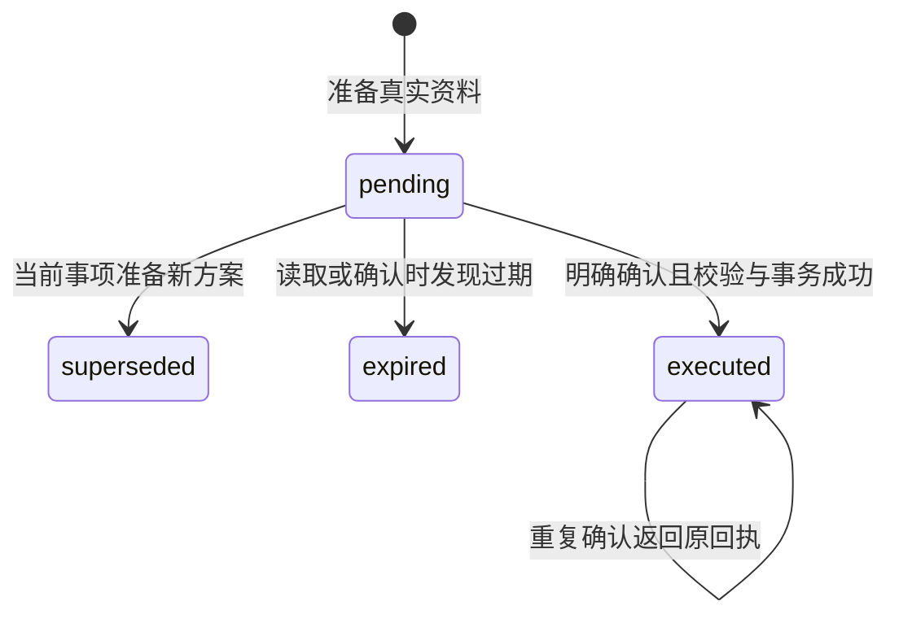

# MediPet 预约、确认与取消

预约是带库存变化的业务操作，不能仅凭模型文字认定完成。MediPet 把查询、准备方案和明确确认分开：模型能帮助选择并展示待确认资料，用户点击确认后，由固定接口执行 Redis 事务并返回原始回执。

## 从真实列表到待确认方案

[HospitalService.search_slots](../hospital/service.py) 按上海业务时钟展开七天排班，读取当前 Redis 库存，返回有序的 `SlotList`。初始化使用 [HospitalStore.ensure_slots](../hospital/store.py) 的 `SET NX` 仅补缺失项，再次初始化不把已有库存恢复成初始值。

[build_hospital_tools](../agents/tools.py) 将查询结果保存到本事项 `SelectionState`。新查询开始就使旧列表不可选择，成功后保存新列表；空结果和错误保留状态，不能继续用上轮的“第一个”。查询名称要能匹配演示目录，日期和时段经过服务校验。

`prepare_appointment` 只接受真实 `slot_id` 或当前列表的一基 `selection_index`，二者不能同时给出。它读取实际号源，构造当前患者与号源资料快照，生成 `pending` 方案，**不减少库存、不写预约记录**。同事项改选会把旧 pending 标记为 `superseded`。默认有效期为 15 分钟，通过 `expires_at` 检查，方案记录本身不会因 Redis TTL 消失。



聊天说“确认”时，Agent 的空参数 `prepare_appointment` 读取当前方案并提示页面确认；模型白名单中不存在真正执行确认的工具。结构化方案与预约卡片来自服务结果，模型文本不会创建它们。

## 薄确认接口做什么

入口为 [api/main.py](../api/main.py) 的 `confirm_appointment`：

```http
POST /appointment-proposals/{proposal_id}/confirm
Content-Type: application/json

{"user_id":"anonymous","conv_id":"当前事项 ID"}
```

`ConfirmRequest` 只有参与者和事项；患者从事项重新读取，接口不接受客户端提供库存、费用、患者资料或方案快照。`VisitStore.require_identity` 与 `HospitalService._check_owner` 再次核对患者和事项，已归档事项不能执行。

`HospitalService.confirm_proposal` 在同一 Redis pipeline 中 WATCH 方案、事项、选择状态及号源，取消时还 WATCH 原预约。它检查方案仍为当前有效 pending、确认快照与实际号源资料一致、目标可用及库存条件，然后 `MULTI/EXEC` 一次更新库存、预约、患者预约索引、方案原始回执及当前选择状态。

- 创建时扣一个号源并写一条 `active` 预约；准备阶段不预占库存，因此确认时仍可能无余量。
- 取消时要求目标是当前患者的有效预约，改为 `cancelled` 并恢复一个号源；取消也先准备方案再明确确认。
- WATCH 冲突返回可重试 `conflict`，不会把半套结果写入，也不在服务里无限重试。
- 已执行方案先返回原回执。即使预约后来取消，重复确认旧创建方案仍返回当时的历史快照；当前状态应通过预约查询取得。

预约记录按参与者与患者查询，允许在该患者另一活动事项中查询并准备取消；**方案确认仍绑定生成它的原事项**。本人不能使用孩子的方案、列表或预约。

## 回执、历史和 HTTP 契约

[hospital/models.py](../hospital/models.py) 定义 `ConfirmResponse`：`user_id`、`patient_id`、`conv_id`、`receipt` 和 `artifacts`。回执包含方案 ID、操作类型、预约快照和执行时间。它没有虚构的模型意图、耗时或 Agent 工具 trace。

接口在业务执行后，将确认事件和执行结果追加到完整历史。消息 ID 来自稳定回执 ID，`VisitStore.append_messages` 去重；再使工作窗口失效，让下一轮从含回执的完整历史恢复。若历史保存或窗口刷新失败，接口可能返回错误，但已成功提交的业务不会回滚。重试同一方案会取原回执并补齐后续写入，不重复扣号。

| 业务情况 | HTTP 状态 | 处理含义 |
| --- | --- | --- |
| 不存在的事项、方案或目标 | 404 | 重新查询有效对象 |
| 患者或事项归属冲突 | 403 | 不能在当前身份消费该对象 |
| 缺字段、非法输入 | 422 | 修正输入 |
| 方案已过期 | 410 | 重新查询并准备 |
| 已改选、目标不可用、事务冲突、归档事项等状态冲突 | 409 | 根据 `detail.code` 重新读取；仅 `conflict` 可标记重试 |
| 存储不可用或确认后上下文暂未刷新 | 503 | 保留方案 ID，按 `retryable` 重试 |

错误位于 `detail`，含稳定 `code`、`message`、`retryable`。其他固定业务卡片包括 `catalog`、`slot_list`、`appointment_proposal`、`appointment_record`、`visit_checklist`、`wayfinding`、`contact_info`；每种 `data` 均按专属模型校验。

事项相关接口为 `GET /patients`、`GET/POST /visits`、`PATCH /visits/{conv_id}` 和 `GET /visits/{conv_id}/messages`。重命名、归档和恢复只改变事项元数据，保留历史卡片及预约记录。

## 已测证据与取舍

[test_demo_workflow.py](../tests/test_demo_workflow.py) 和 [test_chat_api.py](../tests/test_chat_api.py)共 **24 项替身测试通过**，包括孩子查号与材料、选择、文字确认不执行、按钮确认、查询、取消与重复确认；完整流程在两个独立 fixture 中重复运行。还覆盖目标不可用、患者/事项冲突、过期/改选、确认后窗口失败重试和历史不重复。详见 [API 验证记录](internal/rebuild/specs/S06-api/issues/I04.md)。

[真实存储证据](internal/rebuild/evidence/storage.md)的 10 项预约检查实际使用 Redis，包含同步两次 EXEC 的 WATCH 竞争：同方案并发只创建一次、不同方案竞争最后一个号源不超卖、并发取消只恢复一次。真实归档时序注入用例跳过，未算作通过。

事务边界覆盖业务事实，后续历史写入通过原回执重试恢复；它不是跨 Redis/Chroma 的分布式事务，也没有支付或真实医院履约。原始回执与当前预约状态分开，既便于重复请求安全处理，也要求页面明确展示正在查看的是方案结果还是当前记录。
