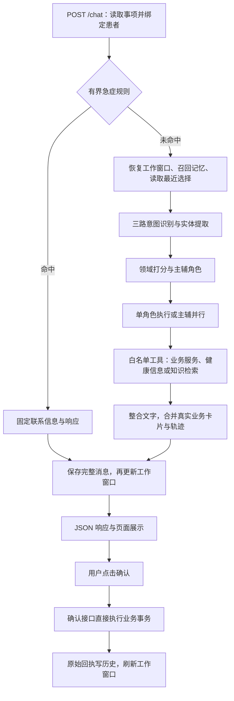

# MediPet 架构与请求链路

MediPet 是面向一家虚构医院的门诊就诊助手。它围绕医院查询、预约、就诊指引，以及有限症状分诊、药品说明书查询和报告整理组织对话，使用 Python/FastAPI、Vue/Vite、Redis 和 Chroma。模型负责理解、选择可用工具和组织回答；患者归属、库存、预约状态及医疗信息卡片由程序校验或生成。

本文对应 U001 医疗扩展的当前源码。旧基准 `c712e87` 的接口、存储、浏览器、容器和两份模型报告保留为历史证据；本轮验收已记录（含完整候选失败与定点复测），见 [U001 检查点](internal/updates/U001-health-consultation/EXECUTION.md)。候选仍需人工接受，各层测试不能互相替代。

## 一次聊天怎样完成

入口是 [api/main.py](../api/main.py) 的 `chat`。页面提交消息、参与者和事项标识；`_load_visit` 先读取事项绑定的患者。已有事项不能被请求中的另一患者覆盖；无事项时，服务创建指定患者或默认本人的事项。

普通路径从 `MemoryManager.get_context` 取得最近消息、摘要、情景片段、资料和当前选择。API 将最近五条消息交给意图识别器，把完整的记忆提示文本交给编排请求；已经识别的意图和实体随请求传入，编排器不会重复分类。直接调用编排器的评测路径则由 `AgentOrchestrator.run` 补做分类。

急症由 [core/emergency.py](../core/emergency.py) 的共享检测入口处理，发生在普通记忆召回、意图模型和预约工具之前。固定响应仍写完整历史及工作窗口，但使用 `compress=False`，不启动摘要或画像模型。规则覆盖有限胸痛、呼吸困难、意识异常等表达和超过 39.5℃ 的演示中断条件，区分否定、历史及一般咨询；它不是通用临床分诊标准。

## 六个角色与工具路径

| 角色 | 处理的问题 | 实际执行方式 |
| --- | --- | --- |
| General | 医院、科室、医生和需求澄清 | 查询公开目录或静态知识 |
| Appointment | 号源、患者预约、创建或取消方案 | 直接调用 `HospitalService`，仅准备方案 |
| Guidance | 材料、报到、流程和院内文字指引 | 查询预置材料、地点说明或静态知识 |
| Triage | 症状的初步科室方向、报告原文整理及追问 | `triage_symptoms`、`preprocess_report`、`read_current_report` 和静态知识；不诊断 |
| Medication | 指定药品标签的用法用量、禁忌和组合警示 | `medication_information` 和静态知识；不替用户选药或开处方 |
| Escalation | 人工导诊联系和固定急症响应 | 返回联系资料，不调用普通模型，不声称已通知工作人员 |

[agents/agent_orchestrator.py](../agents/agent_orchestrator.py) 的 `_route_decision` 先确定主辅职责，`run_parallel` 使用 `asyncio.gather` 并行执行。`ResponseComposer` 整理成功结果，失败时保留可用回答。业务卡片从每次工具返回中单独收集，不由最终文字生成，模型说“预约成功”不会因此产生预约记录。详见[意图与路由](intent-routing.md)、[工具与检索](tools-rag.md)。

动态业务通过 [agents/tools.py](../agents/tools.py) 的闭包注入服务，避免进入公共检索缓存。健康信息工具读取有界规则、固定药品标签或当前事项真实报告，静态文档才经过 `MCPToolManager` 的改写、召回和重排。这里的 MCP 模块是进程内工具管理器，没有实现独立 MCP 协议服务器。

## 报告上传是独立的确定性入口

`POST /reports/preprocess` 先校验患者与事项，再调用 [health/report_upload.py](../health/report_upload.py)。文字 PDF 提取文本；无文本的扫描页与 PNG/JPEG/WebP 使用本地 Tesseract 中英文 OCR。文件最多 10 MB，PDF 为 1–10 页；损坏、加密、超限、无文字或识别失败返回明确错误。整个上传预处理不请求大模型。

[health/reports.py](../health/reports.py) 只整理原文项目、数值、单位及明确参考范围；无法可靠解析的项标为待核对，OCR 低置信度时不做范围判断。API 不保存原始文件，保存的是当前事项中的上传消息、提取文字和 `report_summary` 卡片。后续 Triage 通过 `read_current_report` 读取当前绑定患者、当前事项的最新报告；没有报告时返回未找到，不跨事项借用，也不凭压缩摘要重造数值。具体边界见[健康咨询](health-consultation.md)。

## 状态各自存在哪里

| 数据 | 实现入口 | 用途和保留方式 |
| --- | --- | --- |
| 医院目录、排班模板、材料和文字路线 | [hospital/demo_data.json](../hospital/demo_data.json)、`HospitalService` | 演示事实来源；路线为预置文本 |
| 患者、事项、完整消息、最近选择 | [memory/visit_store.py](../memory/visit_store.py) | Redis 持久业务数据；保留卡片与消息 ID，归档不删除 |
| 号源库存、方案、预约及原始回执 | [hospital/store.py](../hospital/store.py)、[hospital/service.py](../hospital/service.py) | Redis 事务维护；不使用工作窗口 TTL |
| 工作窗口、摘要 | [memory/conversation_memory.py](../memory/conversation_memory.py) | 按参与者、患者、事项隔离，24 小时 TTL |
| 情景记忆、患者资料、表达偏好 | 同上 | Chroma 独立集合，显式身份过滤 |
| 医院和医疗知识片段 | [mcp/knowledge_base.py](../mcp/knowledge_base.py) | 24 份文档进入 `medipet_knowledge`，稳定片段 ID 与来源 |
| 分诊来源与两个药品标签 | [health/data](../health/data) | 版本化静态 JSON，明确来源与核对日期 |
| 报告提取文字与卡片 | 当前事项完整历史 | 原始文件不保留；派生内容随事项历史保存，按患者和事项读取 |

页面通过 [PatientVisitPanel.vue](../frontend/src/components/PatientVisitPanel.vue) 管理患者与事项，通过 [BusinessArtifacts.vue](../frontend/src/components/BusinessArtifacts.vue) 消费固定类型卡片。聊天响应含文字、`artifacts`、本轮 `tool_traces`、主辅角色及路由理由；确认响应只含身份、回执与卡片，二者协议分开。详见[预约闭环](appointments.md)。

## 已验证内容与取舍

以下预约/存储数量属于医疗扩展前的旧基准；本轮分诊、药品与知识/Skill 的 97 项局部确定性检查见[来源证据](internal/updates/U001-health-consultation/evidence/medical-sources.md)，不能替代 OCR、浏览器或真实模型验收。

- [API 闭环测试](../tests/test_demo_workflow.py) 和 [API 边界测试](../tests/test_chat_api.py) 共 **24 项通过**：执行真实 API 函数、Agent 工具及业务服务，模型、Redis、Chroma 为确定性替身。覆盖孩子预约至取消、文字确认不执行、重复确认、患者隔离和历史恢复。
- [真实存储证据](internal/rebuild/evidence/storage.md)记录 **18 项真实 Redis/Chroma 检查通过**，证明事务竞争、患者过滤、真实过期和重新初始化语义。摘要模型仍为替身。
- [评测说明](evaluation.md)区分模型质量与业务状态；浏览器、容器和完整真实模型验收需各自的运行证据，不能用接口替身测试代替。

采用一套具体医院服务和有限角色，使调用路径与失败状态可以直接追踪。代价是业务范围固定：分诊只使用现有内科、儿科、眼科，药品只覆盖两个指定美国标签；不连接真实医院、不诊断或开处方、不评价其他医生方案、不计算实时导航。当前预置参与者也不是生产身份认证系统。模型上下文用于理解，实时号源和预约事实仍须查询业务存储。

继续阅读：[意图与路由](intent-routing.md) · [工具与 RAG](tools-rag.md) · [记忆与 Skills](memory-skills.md) · [预约](appointments.md) · [评测](evaluation.md)。
