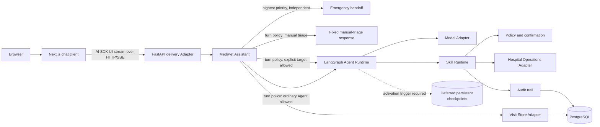

# MediPet Architecture

Status: Accepted

Accepted: 2026-08-29

## Purpose

MediPet is a full-stack conversational web application for one outpatient hospital. A Next.js chat client communicates with a Python backend, where a LangGraph-backed ReAct loop understands a visit participant's intent and invokes typed Skills for pre-visit and in-hospital assistance.

The architecture must preserve the language and rules in `CONTEXT.md`, especially:

- one visit matter belongs to exactly one patient;
- the product serves exactly one hospital;
- department information comes from the service hospital catalog, and the model does not match symptoms to departments;
- deterministic emergency interruption takes priority over the model and ordinary assistance;
- appointment creation and cancellation require authorization and explicit confirmation;
- payment and clinical-record access are outside V1.

## Design principles

- Keep the external Interface small and put orchestration complexity behind deep modules.
- Treat the language model as an untrusted planner, not an authority.
- Allow the model to request only registered, typed Skills.
- Separate read-only queries from effectful actions.
- Make effectful actions prepare a proposal first and commit only after confirmation.
- Inject external dependencies so production and test Adapters cross the same Seams.
- Test observable behaviour through module Interfaces rather than internal ReAct steps.
- Treat target boundaries as extraction triggers, not an implementation checklist: split a module only when delivered behaviour creates a distinct responsibility, replacement Seam, or independently testable contract.

## Technology decisions

| Concern | Choice | Role |
| --- | --- | --- |
| Web application | Next.js App Router, React, TypeScript | Routes, responsive chat shell, browser state |
| Styling and UI primitives | Tailwind CSS, shadcn/ui, AI Elements | Accessible primitives and chat building blocks, customized for MediPet |
| Chat state | AI SDK UI `useChat` | Browser message state and streaming transport only |
| HTTP delivery | FastAPI and Pydantic | Typed JSON requests, ordinary JSON reads, and streaming responses |
| Agent orchestration | LangGraph behind `AgentRuntime` | ReAct execution and streaming; persistent checkpoints and graph resume are deferred |
| Persistence | PostgreSQL, SQLAlchemy asyncio, Alembic | Visit matters, messages, proposals, receipts, authorization, and audit |
| Python tooling | uv, pytest, Ruff, Pyright | Dependencies, verification, formatting, linting, and type checking |
| Web tooling | pnpm, Vitest, Testing Library, Playwright | Dependencies, module tests, and browser scenarios |
| Windows local environment | Docker Desktop and Docker Compose | Containerized Web, backend, PostgreSQL, health checks, and startup order |

AI SDK UI does not run the Agent and is not a second orchestration framework. Next.js does not contain duplicate domain or Skill logic. LangGraph is an implementation choice hidden behind `AgentRuntime`, so the application-facing Interface remains stable.

V1 does not introduce Redis, a vector database, WebSockets, microservices, or Kubernetes. Add one only when a measured requirement creates a real Seam.

## Implementation status and evolution gates

This document describes architectural direction, not a requirement to create every illustrated directory, class, checkpoint, or abstraction. The current modular monolith may keep responsibilities together while their contracts and change patterns remain cohesive.

Current implementation:

- PostgreSQL is the source of truth for visit matters, messages, action proposals, receipts, capability governance, and audits.
- LangGraph runs the model/Tool ReAct loop, but the graph is compiled without a persistent checkpointer; action confirmation is resumed through persisted proposals outside the graph.
- completed conversation history survives API restart, while an unfinished graph node does not resume from a LangGraph checkpoint.
- the Fake HospitalOperations Adapter supplies catalog, slot, appointment, and versioned authoritative text wayfinding data for the fictional development hospital.
- Web renders application-owned `data-hospital-wayfinding` and `data-hospital-wayfinding-unavailable` cards for the local fictional hospital; it does not model a building, draw a map, or perform pathfinding.

Approved next-state boundaries:

- visit-matter history management adds rename, reversible archive, restore, and a real empty state without permanent deletion;
- local authoritative text wayfinding is the current product slice; real hospital integration is not on the personal-development roadmap;
- persistent LangGraph checkpoints remain deferred until a graph-internal human interrupt, cross-process long-running task, or concrete need to avoid repeating an expensive Tool establishes a recovery requirement.

Module extraction follows those slices. For example, checkpoint work may eventually separate serializable graph state from runtime dependencies, while wayfinding may justify a cohesive Tool or message-part module. Neither future possibility authorizes a repository-wide layout migration.

## System flow



The Assistant remains the application-facing deep module. HTTP and future delivery Adapters do not coordinate the Agent Runtime, Skill Runtime, persistence, confirmation, or recovery themselves.

## Web chat experience

### Interaction layout

The web application uses a familiar AI-chat composition while preserving the identity of a hospital visit assistant:

- a left rail lists visit matters, not generic chat sessions;
- the central thread streams text and structured assistance cards;
- a sticky composer supports send, stop, retry, and accessible keyboard operation;
- a collapsible right rail shows the current patient, visit stage, authorization state, and pending appointment;
- mobile layouts move both rails into drawers while keeping the thread and composer primary.

The thread renders these typed data parts:

| Data part | Presentation |
| --- | --- |
| `data-agent-status` | Transient progress such as checking hospital slots |
| `data-slot-options` | Selectable doctor, date, time, and fee options |
| `data-action-proposal` | Exact create/cancel proposal with confirm and reject controls |
| `data-hospital-wayfinding` | Local fictional-hospital origin, destination, ordered authoritative text directions, mode, and optional notice |
| `data-hospital-wayfinding-unavailable` | Recoverable explanation when an exact origin/destination/mode selection has no available text guidance |
| `data-handoff` | Human or emergency handoff with priority-specific treatment |

Internal Thought text is never streamed. The client may show understandable progress, Skill names, and completed outcomes, but never chain-of-thought.

### Visual direction

The interface follows a quiet clinical-editorial direction rather than a generic AI dashboard:

- warm ivory surfaces, deep teal structure, ink text, and vermilion reserved for urgent states;
- a Chinese serif display face paired with a highly legible Chinese sans-serif body face;
- generous reading width, restrained borders, and tactile paper-like depth instead of purple gradients;
- short card and message transitions that respect `prefers-reduced-motion`;
- WCAG 2.2 AA contrast, keyboard navigation, visible focus, and polite live-region announcements.

shadcn/ui and AI Elements are source primitives to customize, not a default visual theme to ship unchanged.

## Browser-to-backend Interface

The browser uses AI SDK UI's message-stream protocol over HTTP Server-Sent Events:

- `POST /v1/chat/turns` accepts a typed turn and streams text plus structured data parts;
- `POST /v1/action-proposals/{proposal_id}/decision` accepts an explicit confirm or reject decision;
- visit-matter and message-history reads use ordinary JSON responses;
- visit-matter history management uses ordinary JSON rename, archive, archived-list, and restore operations; archived matters remain readable but must be restored before chat or confirmation;
- production exposes the web application and `/v1/` under one origin through routing infrastructure;
- development may use CORS, but it is not the production trust model.

The decision endpoint is mapped back to `MediPetAssistant.handle_turn` as a typed confirmation response. A button decision is never converted into an unstructured natural-language message.

FastAPI emits the stream directly. A Next.js route handler may route bytes only when hosting requires it; it must not interpret Agent state, authorize actions, or duplicate the stream protocol.

## Canonical code vocabulary

| Domain term | Python name | Notes |
| --- | --- | --- |
| 患者 | `Patient` | The person receiving care |
| 就诊参与者 | `VisitParticipant` | The person interacting with MediPet |
| 就诊事项 | `VisitMatter` | May span multiple conversations; never mixes patients |
| 门诊就诊 | `OutpatientVisit` | The planned or actual hospital visit |
| 服务医院 | `Hospital` | The one hospital served by this deployment |
| 症状陈述 | `SymptomStatement` | Unverified participant-provided information |
| 预约挂号 | `Appointment` | A patient holding a hospital slot |
| 预约确认 | `AppointmentConfirmation` | Explicit consent bound to exact action details |
| 紧急转介 | `EmergencyHandoff` | Overrides ordinary assistance |
| 归档就诊事项 | `ArchivedVisitMatter` lifecycle | Reversibly hidden from active history without deleting records |
| 院内服务地点 | `HospitalServiceLocation` | A hospital-approved destination such as a department, pharmacy, cashier, laboratory, or imaging service |
| 院内方位指引 | `HospitalWayfindingGuidance` | Hospital-approved ordered text from a named common origin; no map or path calculation |

Do not use `User`, `Task`, `Session`, or `MedicalCase` as substitutes for these domain concepts.

## Module Interfaces

### 1. MediPet Assistant

This is the only Interface used by an HTTP, CLI, or future chat-channel Adapter.

```python
class MediPetAssistant(Protocol):
    def handle_turn(
        self,
        command: TurnCommand,
    ) -> AsyncIterator[TurnEvent]: ...
```

`TurnCommand` contains:

- conversation identifier;
- visit-matter identifier;
- participant identifier;
- participant message;
- idempotency key;
- an optional confirmation response.

The `TurnEvent` stream may contain:

- safe participant-facing text deltas;
- typed structured data parts;
- an optional pending action proposal;
- handoff information when human or emergency help is required;
- transient progress without internal Thought text;
- exactly one completed or failed terminal event with a trace identifier.

Interface invariants:

- the referenced visit matter already determines the patient;
- a participant cannot silently switch patients inside a visit matter;
- repeated idempotency keys produce the same observable result;
- raw model output and internal reasoning are never returned;
- a pending effectful action ends the current ReAct run.
- a success event is emitted only after required state and audit records are persisted.

The implementation loads the visit matter, applies deterministic turn handling, maps approved internal events into `TurnEvent` values, persists resulting state and audit records, then closes the stream with one terminal event. It owns four effective routes:

1. **Emergency handoff:** an independent current-message check runs first and has the highest priority. A match persists and returns the emergency handoff without entering the turn policy, model, or Skill execution.
2. **Manual triage:** the turn policy returns a fixed participant-facing manual-triage response. The Assistant persists and streams that response without invoking the model, Agent Runtime, or any Tool.
3. **Explicit target allowed:** a current-turn department, hospital service location, or selected slot may proceed, but only as a participant-selected target for trusted hospital lookup or an authorized action. It does not establish that the target is medically suitable for the stated symptoms.
4. **Ordinary Agent allowed:** other permitted visit assistance proceeds normally.

The last two routes converge on the same existing Skill-first Agent Runtime. The policy is not a second business-intent router and does not select Skills or Tools; Skill discovery, trusted Tool exposure, hospital facts, authorization, confirmation, and execution remain owned by the existing runtime seams.

The turn policy receives only `current_message`, the optional nearest strictly earlier participant message, and whether the current turn contains a selected slot. The previous participant message is found by excluding the just-persisted current turn and skipping intervening Assistant messages; it is used only for an elliptical department-choice, comparison, suitability, or destination follow-up. The policy does not scan the complete visit matter for symptom context. Only a slot selected in the current turn is an allow signal: a department or hospital service location recovered from historical wayfinding or other earlier structured state cannot authorize the current turn.

### 2. Agent Runtime

```python
class AgentRuntime(Protocol):
    def run(
        self,
        request: AgentRequest,
    ) -> AsyncIterator[AgentEvent]: ...
```

The runtime hides:

- construction of model context;
- the Thought/Action/Observation loop;
- Skill discovery and schema presentation;
- step, token, and time budgets;
- malformed action recovery;
- loop detection;
- trace collection;
- conversion of internal failures into safe outcomes.

The current implementation uses LangGraph for the ReAct state graph and streaming. It does not yet compile a persistent checkpointer or use graph interrupts and resume. Those capabilities may be added behind this Interface only after an approved recovery trigger is present. LangGraph types do not cross this Interface, so callers and tests do not depend on graph nodes, future checkpoint schemas, or framework message types.

The Assistant applies deterministic emergency interruption and the turn policy before entering the graph. Only explicit-target and ordinary-Agent outcomes enter this runtime, and both use this same Skill-first path. The current graph contains model calls, validated Tool execution, action-proposal production, and finish paths; persisted proposal decisions and confirmed writes execute outside the graph. Human handoff and graph-internal pause/resume are future slices, not latent requirements to pre-build nodes. Only explicitly mapped `AgentEvent` values may leave the runtime.

The model crosses a true external Seam:

```python
class ModelPort(Protocol):
    def stream(self, request: ModelRequest) -> AsyncIterator[ModelChunk]: ...
```

Production uses a provider Adapter. Tests use a deterministic fake Adapter. Provider response
objects and reasoning metadata remain inside the Adapter; only mapped model chunks cross this Seam.

### 3. Skill Runtime

```python
class SkillRuntime(Protocol):
    async def execute(
        self,
        call: SkillCall,
        context: SkillContext,
    ) -> SkillOutcome: ...
```

This is a deep module. It owns:

- registry lookup and allowlisting;
- typed argument validation;
- participant and visit-matter scoping;
- read versus write effect classification;
- authorization checks;
- emergency precedence;
- action proposal creation;
- confirmation validation;
- idempotent commit;
- timeout and failure normalization;
- audit events.

Individual Skills satisfy one small internal Interface:

```python
class Skill(Protocol):
    manifest: SkillManifest

    async def invoke(
        self,
        request: SkillRequest,
        dependencies: SkillDependencies,
    ) -> SkillResult: ...
```

Skills do not call model providers, persistence, or hospital systems directly. They receive only the dependencies allowed by the Skill Runtime.

Initial Skills:

| Skill | Effect | Responsibility |
| --- | --- | --- |
| `list_departments` | Read | Return department names and descriptions from the service hospital catalog |
| `search_slots` | Read | Query available slots inside the hospital |
| `prepare_appointment` | Read | Build an exact appointment proposal without reserving a slot |
| `commit_appointment` | Write | Create an authorized, confirmed appointment idempotently |
| `prepare_cancellation` | Read | Build an exact cancellation proposal |
| `commit_cancellation` | Write | Cancel an authorized, confirmed appointment idempotently |
| `hospital-wayfinding` | Read | Return an exact local fictional-hospital text direction for a participant-selected origin, destination, and mode |
| `handoff-to-human` | Write | Planned: create a handoff record for hospital staff |

The model cannot invent a Skill name or bypass the prepare/confirm/commit sequence.

### 4. Hospital Operations

Hospital integration crosses a Seam because production and test behaviour must vary without changing Skills.

```python
class HospitalOperations(Protocol):
    async def query(self, query: HospitalQuery) -> HospitalQueryResult: ...
    async def commit(self, action: ConfirmedHospitalAction) -> ActionReceipt: ...
```

A future production Adapter may translate between MediPet's domain types and hospital systems, but it is not required by the personal-development roadmap. The current Fake Adapter supplies deterministic departments, doctors, slots, appointments, failures, and versioned text wayfinding for the fictional development hospital. Those directions extend the same HospitalOperations query boundary with stable origins, service locations, modes, and data versions; they do not create a parallel Adapter hierarchy or a building model.

There is no hospital selector, tenant identifier, cross-hospital query, or tenant-aware configuration in this Interface.

### 5. Visit Store

```python
class VisitStore(Protocol):
    async def load(self, visit_matter_id: VisitMatterId) -> VisitMatter: ...
    async def save(
        self,
        visit_matter: VisitMatter,
        expected_version: int,
    ) -> None: ...
```

Optimistic versioning prevents concurrent turns from overwriting each other. Production and in-memory Adapters must pass the same contract tests.

Conversation history is subordinate to a visit matter. It is not the source of patient identity or authorization.

The production Adapter uses PostgreSQL through SQLAlchemy's asyncio Interface, with Alembic migrations. PostgreSQL is the source of truth for visit matters, messages, authorization, action proposals, receipts, and audit records.

If a future recovery trigger activates persistent LangGraph checkpoints, they store only resumable execution state. They do not replace the Visit Store or become the source of truth for participant-visible history, patient identity, authorization, or committed hospital actions. Checkpoint state must be serializable, encrypted and retained under an explicit lifecycle; none of these requirements are implemented by merely adding a checkpointer to `graph.compile()`.

## Effectful-action protocol

An appointment mutation follows a two-phase protocol:

1. The Agent requests a prepare Skill.
2. The Skill Runtime validates scope and returns a complete action proposal.
3. The Assistant presents the proposal and stops the ReAct run.
4. The participant explicitly confirms the proposal.
5. The Skill Runtime verifies authorization, proposal identity, expiry, and idempotency.
6. A commit Skill calls Hospital Operations.
7. The resulting receipt and audit event are persisted before success is reported.

A confirmation is bound to the exact patient, hospital operation, parameters, expiry, and idempotency key. Any material change invalidates it.

## Safety precedence

Before model or Skill execution, the Assistant checks only the current participant message for a finite set of explicit emergency signals drawn from official 120 public guidance. A match persists and returns an `EmergencyHandoff`, stops the turn, and directs the participant to call 120, seek the nearest emergency department, or ask someone nearby for help. The check does not produce a diagnosis or risk score and does not create a review queue, notification, or resumable workflow.

Explicit negation and clearly educational or hypothetical questions do not trigger the interruption. Messages without a matching signal continue to the deterministic turn policy, which may return fixed manual triage, explicit-target allowance, or ordinary-Agent allowance. Skills and the model cannot suppress a handoff once the Assistant has produced it.

This emergency boundary is independent from the manual-triage route used when a participant asks MediPet to choose, compare, or judge the suitability of a department from symptoms. Manual triage returns fixed text and bypasses both model and Tool execution; it is not an automated department-guidance workflow. The emergency boundary removes only the former emergency risk-review queue, notification, and resume workflow.

## Deployment shape

MediPet has two deployable applications and one required datastore:

- a Next.js web application;
- a FastAPI Python backend implemented as a modular monolith;
- PostgreSQL.

Production routing presents the web application and `/v1/` under one origin. The backend alone owns Agent execution and hospital credentials. The canonical Windows development flow is defined by ADR 0006: root Docker Compose runs Web, backend, and PostgreSQL as separate services, while source bind mounts preserve development file watching. Browser requests use the published API address and Next.js server rendering uses the internal Compose service address. This development choice does not define the production deployment topology.

The web and backend may scale independently later, but V1 does not split the Python backend into networked modules.

Skill packages, declarative Tool contracts, and development capability data are deployment inputs,
not Python package contents. They live under the repository-level `capabilities/` directory and are
mounted read-only into the API container through `MEDIPET_CAPABILITIES_PATH`. Trusted Tool executors
remain in application code and accept only manifest entries whose IDs match deployed executors.

An empty development Registry provisions these repository capabilities as enabled and published
defaults. Later starts only reconcile definitions: they preserve Tool enablement and Skill lifecycle or
active-version decisions, leaving new Tool versions disabled and changed Skill versions as drafts until
an administrator explicitly governs them.

## Repository layout

The following tree is an illustrative ownership map for possible evolution, not a prescribed directory manifest. Existing cohesive modules may remain consolidated. A named file is created or extracted only when an implementation slice gives it a distinct responsibility and stable contract.

```text
capabilities/
├── skills/
│   ├── hospital-appointment-assistance/
│   ├── hospital-appointment-cancellation/
│   └── hospital-service-catalog/
│       └── each package contains SKILL.md and medipet.json
└── tools/
    ├── hospital.json
    └── fake-hospital.json
apps/
├── web/
│   ├── Dockerfile
│   ├── package.json
│   ├── src/
│   │   ├── app/
│   │   │   ├── layout.tsx
│   │   │   └── (chat)/
│   │   │       └── page.tsx
│   │   ├── features/
│   │   │   └── chat/
│   │   │       ├── chat-shell.tsx
│   │   │       ├── transport.ts
│   │   │       ├── message-types.ts
│   │   │       └── message-parts/               # extract only when cards warrant it
│   │   │           ├── slot-options.tsx
│   │   │           ├── action-proposal.tsx
│   │   │           ├── hospital-wayfinding.tsx
│   │   │           └── handoff.tsx
│   │   ├── components/
│   │   │   └── ui/
│   │   └── styles/
│   │       └── globals.css
│   └── tests/
│       ├── module/
│       └── browser/
└── api/
    ├── Dockerfile
    ├── pyproject.toml
    ├── migrations/
    ├── src/
    │   └── medipet/
    │       ├── assistant.py
    │       ├── contracts.py
    │       ├── domain/
    │       │   ├── models.py
    │       │   └── events.py
    │       ├── agent/
    │       │   ├── runtime.py
    │       │   ├── graph.py                 # future checkpoint-driven extraction
    │       │   ├── state.py                 # serializable state only, when required
    │       │   └── prompts.py
    │       ├── skills/
    │       │   ├── contracts.py
    │       │   ├── runtime.py
    │       │   ├── appointment.py
    │       │   ├── wayfinding.py            # planned authoritative text directions
    │       │   └── handoff.py
    │       ├── hospital/
    │       │   ├── operations.py
    │       │   └── adapters/
    │       │       ├── in_memory.py
    │       │       └── production.py
    │       ├── persistence/
    │       │   ├── visit_store.py
    │       │   └── adapters/
    │       │       ├── in_memory.py
    │       │       └── postgres.py
    │       ├── model/
    │       │   ├── port.py
    │       │   └── adapters/
    │       │       ├── fake.py
    │       │       └── production.py
    │       └── delivery/
    │           ├── http.py
    │           ├── routes/
    │           └── streaming.py
    └── tests/
        ├── scenarios/
        ├── modules/
        └── adapters/
compose.yaml
start.bat
```

The repository remains one domain context even though it contains web and backend applications. The layout follows ownership of behaviour and does not create separate wrapper modules for every class.

## Testing strategy

Tests cross the same Interfaces as callers:

- Assistant scenario tests use a fake Model Adapter, in-memory Hospital Operations Adapter, and in-memory Visit Store Adapter.
- Assistant scenario tests assert emergency interruption precedence; Skill Runtime tests assert authorization, confirmation, schema validation, and idempotency.
- Hospital and Visit Store contract tests run against every Adapter.
- ReAct tests assert observable outcomes, not private Thought text or exact prompt formatting.
- FastAPI stream tests validate event ordering, terminal events, disconnect handling, and AI SDK UI protocol compatibility.
- Vitest and Testing Library tests exercise chat state and every structured message part.
- Playwright scenarios drive the real web application against the in-memory Hospital Operations Adapter.
- A generated or validated schema contract prevents Python event types and TypeScript data parts from drifting.
- Regression tests cover cross-patient isolation, repeated confirmations, expired proposals, stale visit versions, hospital failures, and loop exhaustion.

The first end-to-end scenario is:

1. A participant asks which departments the service hospital provides.
2. MediPet returns department names and descriptions from the hospital catalog without matching symptoms to a department.
3. The participant selects a known department and asks for an available slot.
4. MediPet prepares an appointment proposal.
5. No appointment exists before explicit confirmation.
6. Confirmation commits exactly one appointment.
7. Repeating the same confirmation does not create a duplicate.
8. Reloading the page restores the same visit matter and committed receipt.
9. The browser never receives internal Thought text.

## Deferred decisions

The following choices do not affect the module Interfaces and remain intentionally open:

- model provider and model SDK;
- production hospital transport and authentication;
- hospital identity provider;
- production hosting platform and reverse proxy;
- data-retention periods and archival policy.

Persistent LangGraph checkpoints are also deferred, but their activation test is explicit rather than open-ended: introduce them only for graph-internal human interruption, a cross-process long-running run, or a demonstrated need to resume after a durable node boundary without repeating an expensive Tool. Completed message-history recovery alone is not such a trigger because the Visit Store already provides it.

Hospital wayfinding is governed by [ADR-0011](../adr/0011-use-authoritative-text-wayfinding.md). Its text contract may mention buildings and floors, but MediPet does not model or calculate them. A future structured map or dynamic route engine requires a new decision rather than filling in dormant classes from this document.

These choices should be made only when the next implementation slice requires them.

## Official references

- [Next.js App Router](https://nextjs.org/docs/app)
- [AI SDK UI transport](https://ai-sdk.dev/docs/ai-sdk-ui/transport)
- [AI SDK UI stream protocol](https://ai-sdk.dev/docs/ai-sdk-ui/stream-protocol)
- [FastAPI streaming responses](https://fastapi.tiangolo.com/advanced/custom-response/)
- [LangGraph overview](https://docs.langchain.com/oss/python/langgraph/overview)
- [LangGraph human-in-the-loop](https://docs.langchain.com/oss/python/langchain/human-in-the-loop)
- [SQLAlchemy asyncio](https://docs.sqlalchemy.org/en/20/orm/extensions/asyncio.html)
- [uv projects](https://docs.astral.sh/uv/guides/projects/)
