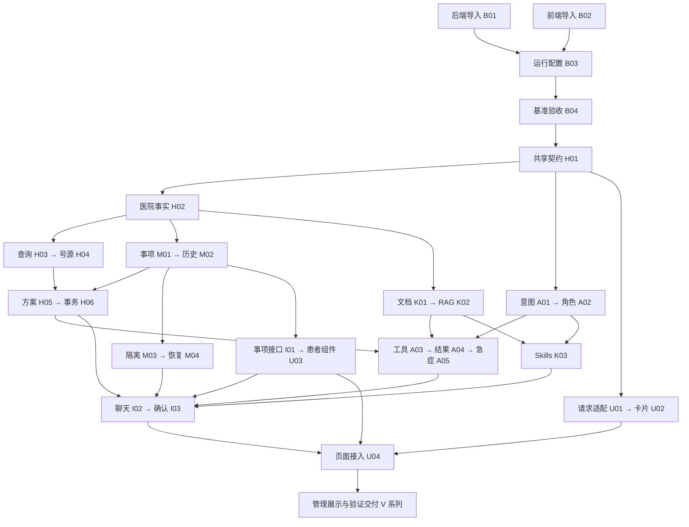

# 依赖与并行安排

本表是 issue 头部 `depends_on` 的调度视图。共 **40 个节点、72 条直接依赖**，初始状态全部为 `todo`。依赖图已核对无环、无缺失 ID；后续变更先维护 issue，再同步此处。

依赖包含产物前置和共享文件的修改顺序。“可并行”还要求文件范围不相交、运行环境隔离；阶段编号本身不是前置。执行与状态规则见[工作索引](README.md)。

## 主干与分流

下图展示主要交接点；完整前置以后一节的逐项表为准。

图中的合并节点用于阅读，不是整条支线的额外等待条件。例如 A03 只等待 H05，不必等待 H06；完整表对此作精确区分。

## 逐项依赖与下游

| Issue | 交付结果 | 直接前置 | 直接解锁 |
| --- | --- | --- | --- |
| [B01](specs/S01-baseline/issues/B01.md) | 导入并命名后端基准 | 无 | [B03](specs/S01-baseline/issues/B03.md) |
| [B02](specs/S01-baseline/issues/B02.md) | 导入前端并收敛 Python 请求入口 | 无 | [B03](specs/S01-baseline/issues/B03.md) |
| [B03](specs/S01-baseline/issues/B03.md) | 接通开发与容器运行配置 | [B01](specs/S01-baseline/issues/B01.md)、[B02](specs/S01-baseline/issues/B02.md) | [B04](specs/S01-baseline/issues/B04.md) |
| [B04](specs/S01-baseline/issues/B04.md) | 验收基准机制并建立工作树索引 | [B03](specs/S01-baseline/issues/B03.md) | [H01](specs/S02-hospital/issues/H01.md)、[K02](specs/S05-knowledge/issues/K02.md) |
| [H01](specs/S02-hospital/issues/H01.md) | 冻结跨模块契约并建立医院领域模型 | [B04](specs/S01-baseline/issues/B04.md) | [H02](specs/S02-hospital/issues/H02.md)、[M01](specs/S03-memory/issues/M01.md)、[A01](specs/S04-agents/issues/A01.md)、[I01](specs/S06-api/issues/I01.md)、[U01](specs/S07-ui/issues/U01.md) |
| [H02](specs/S02-hospital/issues/H02.md) | 建立统一医院演示数据与排班内容 | [H01](specs/S02-hospital/issues/H01.md) | [H03](specs/S02-hospital/issues/H03.md)、[M01](specs/S03-memory/issues/M01.md)、[K01](specs/S05-knowledge/issues/K01.md)、[V01](specs/S08-delivery/issues/V01.md) |
| [H03](specs/S02-hospital/issues/H03.md) | 实现医院目录准备清单和文字指引查询 | [H02](specs/S02-hospital/issues/H02.md) | [H04](specs/S02-hospital/issues/H04.md) |
| [H04](specs/S02-hospital/issues/H04.md) | 实现持久化号源生成与剩余量查询 | [H03](specs/S02-hospital/issues/H03.md) | [H05](specs/S02-hospital/issues/H05.md) |
| [H05](specs/S02-hospital/issues/H05.md) | 实现待确认方案预约查询与改选淘汰 | [H04](specs/S02-hospital/issues/H04.md)、[M02](specs/S03-memory/issues/M02.md) | [H06](specs/S02-hospital/issues/H06.md)、[A03](specs/S04-agents/issues/A03.md) |
| [H06](specs/S02-hospital/issues/H06.md) | 实现创建取消的原子确认与幂等回执 | [H05](specs/S02-hospital/issues/H05.md) | [I03](specs/S06-api/issues/I03.md)、[V03](specs/S08-delivery/issues/V03.md)、[V05](specs/S08-delivery/issues/V05.md) |
| [M01](specs/S03-memory/issues/M01.md) | 实现预置患者与事项元数据存储 | [H01](specs/S02-hospital/issues/H01.md)、[H02](specs/S02-hospital/issues/H02.md) | [M02](specs/S03-memory/issues/M02.md) |
| [M02](specs/S03-memory/issues/M02.md) | 持久化完整消息业务卡片和事项选择上下文 | [M01](specs/S03-memory/issues/M01.md) | [H05](specs/S02-hospital/issues/H05.md)、[M03](specs/S03-memory/issues/M03.md)、[I01](specs/S06-api/issues/I01.md) |
| [M03](specs/S03-memory/issues/M03.md) | 为工作情景及画像记忆增加患者作用域 | [M02](specs/S03-memory/issues/M02.md) | [M04](specs/S03-memory/issues/M04.md) |
| [M04](specs/S03-memory/issues/M04.md) | 实现工作记忆失效后的历史恢复与多轮承接 | [M03](specs/S03-memory/issues/M03.md) | [I02](specs/S06-api/issues/I02.md)、[V02](specs/S08-delivery/issues/V02.md)、[V03](specs/S08-delivery/issues/V03.md)、[V05](specs/S08-delivery/issues/V05.md) |
| [A01](specs/S04-agents/issues/A01.md) | 医院意图实体与分类示例适配 | [H01](specs/S02-hospital/issues/H01.md) | [A02](specs/S04-agents/issues/A02.md)、[V01](specs/S08-delivery/issues/V01.md) |
| [A02](specs/S04-agents/issues/A02.md) | 四角色路由协作及请求上下文适配 | [A01](specs/S04-agents/issues/A01.md) | [A03](specs/S04-agents/issues/A03.md)、[K03](specs/S05-knowledge/issues/K03.md) |
| [A03](specs/S04-agents/issues/A03.md) | 医院工具白名单和缓存边界接入 | [A02](specs/S04-agents/issues/A02.md)、[H05](specs/S02-hospital/issues/H05.md)、[K02](specs/S05-knowledge/issues/K02.md) | [A04](specs/S04-agents/issues/A04.md) |
| [A04](specs/S04-agents/issues/A04.md) | 本轮业务结果透传与成功trace修正 | [A03](specs/S04-agents/issues/A03.md) | [A05](specs/S04-agents/issues/A05.md) |
| [A05](specs/S04-agents/issues/A05.md) | 共享急症检查和导诊固定响应 | [A04](specs/S04-agents/issues/A04.md) | [I02](specs/S06-api/issues/I02.md)、[V02](specs/S08-delivery/issues/V02.md) |
| [K01](specs/S05-knowledge/issues/K01.md) | 编写统一医院事实的知识短文档 | [H02](specs/S02-hospital/issues/H02.md) | [K02](specs/S05-knowledge/issues/K02.md) |
| [K02](specs/S05-knowledge/issues/K02.md) | 医院知识初始化与来源失败透传 | [K01](specs/S05-knowledge/issues/K01.md)、[B04](specs/S01-baseline/issues/B04.md) | [A03](specs/S04-agents/issues/A03.md)、[K03](specs/S05-knowledge/issues/K03.md)、[V03](specs/S08-delivery/issues/V03.md)、[V05](specs/S08-delivery/issues/V05.md) |
| [K03](specs/S05-knowledge/issues/K03.md) | 四组场景Skills匹配与主动重载 | [A02](specs/S04-agents/issues/A02.md)、[K02](specs/S05-knowledge/issues/K02.md) | [I02](specs/S06-api/issues/I02.md)、[U05](specs/S07-ui/issues/U05.md)、[V07](specs/S08-delivery/issues/V07.md) |
| [I01](specs/S06-api/issues/I01.md) | 患者与事项接口及服务器身份加载 | [M02](specs/S03-memory/issues/M02.md)、[H01](specs/S02-hospital/issues/H01.md) | [I02](specs/S06-api/issues/I02.md)、[U03](specs/S07-ui/issues/U03.md) |
| [I02](specs/S06-api/issues/I02.md) | 聊天接通记忆历史结构化结果和急症前置 | [I01](specs/S06-api/issues/I01.md)、[A05](specs/S04-agents/issues/A05.md)、[M04](specs/S03-memory/issues/M04.md)、[K03](specs/S05-knowledge/issues/K03.md) | [I03](specs/S06-api/issues/I03.md) |
| [I03](specs/S06-api/issues/I03.md) | 创建与取消统一确认接口和历史回执 | [I02](specs/S06-api/issues/I02.md)、[H06](specs/S02-hospital/issues/H06.md) | [I04](specs/S06-api/issues/I04.md)、[U04](specs/S07-ui/issues/U04.md) |
| [I04](specs/S06-api/issues/I04.md) | 确定性API闭环正反例验收 | [I03](specs/S06-api/issues/I03.md) | [V04](specs/S08-delivery/issues/V04.md)、[V07](specs/S08-delivery/issues/V07.md) |
| [U01](specs/S07-ui/issues/U01.md) | 前端API请求适配与契约样例 | [H01](specs/S02-hospital/issues/H01.md) | [U02](specs/S07-ui/issues/U02.md)、[U03](specs/S07-ui/issues/U03.md) |
| [U02](specs/S07-ui/issues/U02.md) | 固定业务卡片与确认交互事件 | [U01](specs/S07-ui/issues/U01.md) | [U04](specs/S07-ui/issues/U04.md) |
| [U03](specs/S07-ui/issues/U03.md) | 独立患者事项与完整历史管理入口 | [U01](specs/S07-ui/issues/U01.md)、[I01](specs/S06-api/issues/I01.md) | [U04](specs/S07-ui/issues/U04.md) |
| [U04](specs/S07-ui/issues/U04.md) | 页面壳接入聊天卡片确认及患者事项 | [U02](specs/S07-ui/issues/U02.md)、[U03](specs/S07-ui/issues/U03.md)、[I03](specs/S06-api/issues/I03.md) | [U05](specs/S07-ui/issues/U05.md) |
| [U05](specs/S07-ui/issues/U05.md) | 运行详情知识Skills与监控评测页面整合 | [U04](specs/S07-ui/issues/U04.md)、[K03](specs/S05-knowledge/issues/K03.md)、[V02](specs/S08-delivery/issues/V02.md) | [V04](specs/S08-delivery/issues/V04.md)、[V05](specs/S08-delivery/issues/V05.md) |
| [V01](specs/S08-delivery/issues/V01.md) | 编写医院意图、多轮与边界评测集 | [H02](specs/S02-hospital/issues/H02.md)、[A01](specs/S04-agents/issues/A01.md) | [V02](specs/S08-delivery/issues/V02.md) |
| [V02](specs/S08-delivery/issues/V02.md) | 适配评测执行与结果记录 | [V01](specs/S08-delivery/issues/V01.md)、[A05](specs/S04-agents/issues/A05.md)、[M04](specs/S03-memory/issues/M04.md) | [U05](specs/S07-ui/issues/U05.md)、[V06](specs/S08-delivery/issues/V06.md)、[V07](specs/S08-delivery/issues/V07.md) |
| [V03](specs/S08-delivery/issues/V03.md) | 验证真实 Redis 与 Chroma 数据语义 | [H06](specs/S02-hospital/issues/H06.md)、[M04](specs/S03-memory/issues/M04.md)、[K02](specs/S05-knowledge/issues/K02.md) | [V04](specs/S08-delivery/issues/V04.md)、[V07](specs/S08-delivery/issues/V07.md) |
| [V04](specs/S08-delivery/issues/V04.md) | 验收浏览器业务与管理流程 | [U05](specs/S07-ui/issues/U05.md)、[I04](specs/S06-api/issues/I04.md)、[V03](specs/S08-delivery/issues/V03.md) | [V06](specs/S08-delivery/issues/V06.md) |
| [V05](specs/S08-delivery/issues/V05.md) | 验证容器持久化并提供定向演示重置 | [U05](specs/S07-ui/issues/U05.md)、[H06](specs/S02-hospital/issues/H06.md)、[M04](specs/S03-memory/issues/M04.md)、[K02](specs/S05-knowledge/issues/K02.md) | [V06](specs/S08-delivery/issues/V06.md)、[V08](specs/S08-delivery/issues/V08.md) |
| [V06](specs/S08-delivery/issues/V06.md) | 执行实际模型演示并生成首次基线 | [V02](specs/S08-delivery/issues/V02.md)、[V04](specs/S08-delivery/issues/V04.md)、[V05](specs/S08-delivery/issues/V05.md) | [V08](specs/S08-delivery/issues/V08.md) |
| [V07](specs/S08-delivery/issues/V07.md) | 编写与代码对应的模块讲解文档 | [I04](specs/S06-api/issues/I04.md)、[K03](specs/S05-knowledge/issues/K03.md)、[V02](specs/S08-delivery/issues/V02.md)、[V03](specs/S08-delivery/issues/V03.md) | [V08](specs/S08-delivery/issues/V08.md) |
| [V08](specs/S08-delivery/issues/V08.md) | 完成启动、演示与面试交付材料 | [V05](specs/S08-delivery/issues/V05.md)、[V06](specs/S08-delivery/issues/V06.md)、[V07](specs/S08-delivery/issues/V07.md) | [V09](specs/S08-delivery/issues/V09.md) |
| [V09](specs/S08-delivery/issues/V09.md) | 核对需求覆盖并完成重构验收记录 | [V08](specs/S08-delivery/issues/V08.md) | 最终验收 |

## 可并行批次

以下按最长依赖层级列出**理论最早批次**，不是工期估算，也不是新的全局等待屏障。一个 issue 的直接前置完成即可开工，不必等同批其他任务结束。执行人数少于该批任务数时，优先推进当前阻塞下游最多的任务。

| 批次 | 可同时推进的 issue |
| --- | --- |
| 1 | [B01](specs/S01-baseline/issues/B01.md)、[B02](specs/S01-baseline/issues/B02.md) |
| 2 | [B03](specs/S01-baseline/issues/B03.md) |
| 3 | [B04](specs/S01-baseline/issues/B04.md) |
| 4 | [H01](specs/S02-hospital/issues/H01.md) |
| 5 | [H02](specs/S02-hospital/issues/H02.md)、[A01](specs/S04-agents/issues/A01.md)、[U01](specs/S07-ui/issues/U01.md) |
| 6 | [H03](specs/S02-hospital/issues/H03.md)、[M01](specs/S03-memory/issues/M01.md)、[A02](specs/S04-agents/issues/A02.md)、[K01](specs/S05-knowledge/issues/K01.md)、[U02](specs/S07-ui/issues/U02.md)、[V01](specs/S08-delivery/issues/V01.md) |
| 7 | [H04](specs/S02-hospital/issues/H04.md)、[M02](specs/S03-memory/issues/M02.md)、[K02](specs/S05-knowledge/issues/K02.md) |
| 8 | [H05](specs/S02-hospital/issues/H05.md)、[M03](specs/S03-memory/issues/M03.md)、[K03](specs/S05-knowledge/issues/K03.md)、[I01](specs/S06-api/issues/I01.md) |
| 9 | [H06](specs/S02-hospital/issues/H06.md)、[M04](specs/S03-memory/issues/M04.md)、[A03](specs/S04-agents/issues/A03.md)、[U03](specs/S07-ui/issues/U03.md) |
| 10 | [A04](specs/S04-agents/issues/A04.md)、[V03](specs/S08-delivery/issues/V03.md) |
| 11 | [A05](specs/S04-agents/issues/A05.md) |
| 12 | [I02](specs/S06-api/issues/I02.md)、[V02](specs/S08-delivery/issues/V02.md) |
| 13 | [I03](specs/S06-api/issues/I03.md) |
| 14 | [I04](specs/S06-api/issues/I04.md)、[U04](specs/S07-ui/issues/U04.md) |
| 15 | [U05](specs/S07-ui/issues/U05.md)、[V07](specs/S08-delivery/issues/V07.md) |
| 16 | [V04](specs/S08-delivery/issues/V04.md)、[V05](specs/S08-delivery/issues/V05.md)（V04/V05 需隔离实例，否则顺序运行） |
| 17 | [V06](specs/S08-delivery/issues/V06.md) |
| 18 | [V08](specs/S08-delivery/issues/V08.md) |
| 19 | [V09](specs/S08-delivery/issues/V09.md) |

首批只有 B01/B02；在 H01 完成后，意图、医院数据、前端请求可分开推进。H02 完成后，医院服务、事项存储、知识内容各自成为独立工作线。M02 完成后，方案、记忆和事项 API 分流。前端的 U02 与 U03 各自等待输入，可以重叠执行，再由 U04 统一接入页面。

## 共享文件与环境

同一时刻只安排一个写入者；下表已通过依赖排序或消费接口避免并发编辑。实际实现扩大 `touches` 时，先检查是否新增冲突。

| 共享范围 | 修改顺序/责任 |
| --- | --- |
| `hospital/models.py` 与共享字段样例 | H01 先确定；字段调整同步受影响的存储、Agent、API、UI |
| `hospital/service.py`、`hospital/store.py` | H03 → H04 → H05 → H06；下游仅调用 |
| `tests/test_hospital_service.py` | H01 → H02 → H03 → H04 → H06 |
| `memory/visit_store.py` | M01 → M02；H05/A03/API 通过公开方法消费 |
| `memory/conversation_memory.py` 与记忆测试 | M03 → M04；测试文件从 M01/M02 顺序交接 |
| `core/intent_recognizer.py` 与意图测试 | A01 → A02（仅清理过渡旧枚举）→ A05（经 A03—A04 依赖链） |
| `agents/agent_orchestrator.py` 与主回归测试 | B01 → B04 → A02 → A03 → A04 → A05 |
| `agents/tools.py` | A03 → A04；服务生命周期由 I02 接线 |
| `mcp/tool_manager.py` | K02 → A03；`tests/test_knowledge_skills.py` 为 K02 → K03 |
| `api/main.py`、`tests/test_chat_api.py` | I01 → I02 → I03 → I04（I04 只接测试） |
| `frontend/src/lib/backends.js`、请求封装回归测试 | B02 后由 U01 统一适配，组件与页面消费方法 |
| 独立前端组件 | U02 拥有 BusinessArtifacts.vue，U03 拥有 PatientVisitPanel.vue；样式限组件内 |
| `frontend/src/App.vue`、全局样式 | U04 → U05；组件实现不同时修改页面壳 |
| 运行配置、Nginx 与根 README | B03 后，V05 接运行配置；V08 根据结果更新 README |
| `docs/evaluation.md` | V07 模块说明 → V08 正式基线和展示引用 |
| 真实 Redis/Chroma 与演示数据 | V03/V04/V05 使用独立实例或前缀/集合；共享时串行，V05 重置不得干扰其他验证 |
| 正式模型评测 | V06 使用已验收且冻结的数据集、参数和代码；此前结果不自动成为基线 |

H01 的契约、I01/I02/I03 的实际响应与 U01 的样例是一条连续交接链。差异回到契约责任人协调；禁止通过新增另一套字段或解析模型正文绕开交接。共享文件规则用于协作安排，不增加框架、分层或额外产品需求。

## 验证与完成记录

- 编写阶段已检查 ID 唯一、引用存在、依赖无环、所有 issue 可达最终 V09；根据计划写入范围检查未排序的文件重叠。
- 以上只是文档结构与调度检查。实际完成情况由各 issue 及执行检查点维护，不由依赖表推断验收通过。
- 每个 issue 自带完成记录；V09 汇总已有证据，对未完成项保持未完成，避免重复跑已通过且未变化的检查。
