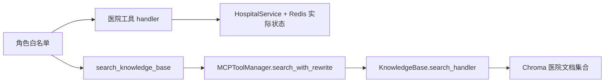

# MediPet 工具调用与知识检索

模型可以提出调用工具的请求，但实际权限、输入校验和结果来源由程序控制。号源与患者预约随操作改变，医院准备材料等文档则相对稳定，因此两者使用不同的执行路径。

## 从模型请求到实际函数

[agents/tools.py](../agents/tools.py) 的 `make_tool` 生成名称、说明、JSON Schema 和 handler；`build_hospital_tools` 用闭包注入 `HospitalService` 与 `VisitStore`。工具参数没有可覆盖患者或事项的身份字段，个人业务从服务端 `Request` 绑定身份。

[agents/agent_orchestrator.py](../agents/agent_orchestrator.py) 的 `BaseAgent._call_llm` 在一次角色执行中**最多请求模型三次**。每次模型可返回多个 `tool_use`：逐个查角色白名单、校验输入，调用 handler，再把真实结果作为 `tool_result` 送回模型。第三次仍要求工具调用会结束为失败；这不是无限工具循环，也不是整次聊天最多三次模型调用——意图识别、多个并行角色、RAG 和整合可能另外调用模型。

白名单与服务校验承担实际约束。General 查询公开目录；Guidance 查询材料与文字指引；Appointment 查询号源/预约并准备方案；Escalation 返回固定联系资料。没有模型可调用的“确认执行”工具。聊天中的“确认预约”只能读取当前方案，真正操作走[确认接口](appointments.md)。

`AgentTurn` 为本轮单独收集 `tools_used`、`tool_traces` 和 `artifacts`。trace 区分调用成功与业务成功，记录输入、延迟、错误及结果摘要；卡片由工具返回后按 [hospital/models.py](../hospital/models.py) 校验并复制。最终生成文字不能凭空补一张预约卡，另一并发患者的结果也不能复用本轮容器。

## 动态业务直连，静态知识走 RAG

`search_slots` 查询前先使旧选择列表不可用，查询成功后保存本事项的有序列表；空结果或失败不会留下能继续选择的旧序号。预约准备、个人记录和库存均直接访问医院服务，不经过 MCP 的公共结果缓存。

普通聊天由角色自行选择是否调用共享 `search_knowledge_base`，并非每条消息先检索。`POST /search` 是直接展示检索链路的入口。项目的 `MCPToolManager` 是进程内注册和调用 handler 的组件，没有独立协议传输、远端 MCP server 或自动服务发现。

## 检索链路与失败语义

[mcp/tool_manager.py](../mcp/tool_manager.py) 的 `search_with_rewrite` 依次执行：

1. 保留原问题，模型最多补三个不同角度的查询。改写失败只用原问题，记录 `rewrite_error`。
2. 用 `asyncio.gather` 并行调用 `knowledge_search`，每个查询至少召回五项或请求的 `top_k`。
3. 优先按稳定 `chunk_id` 去重，旧格式结果按内容去重；失败的召回不伪造文档，写入 `recall_errors`。部分成功时返回已有片段和 `partial`。
4. 候选多于 `top_k` 时请模型输出完整、唯一、范围有效的排序索引。解析失败保留原顺序前 `top_k`，`reranked=false` 并记录 `rerank_error`；候选不足时无需重排。

成功执行但没有文档返回 `no_results`；所有召回都失败返回 `retrieval_failed`。自定义 fallback 的提示仍带 `success=false`，不能冒充检索成功。改写/重排错误属于各自请求结果，没有共享的“上次错误”状态。

底层 `call` 支持参数校验、超时、熔断、缓存及可选降级。应用给静态 `knowledge_search` 配置 300 秒缓存；缓存键是工具名、参数及重排数量，缓存的是该层最终结果。默认工具超时 30 秒，连续失败五次触发熔断，60 秒后尝试恢复。这些机制只覆盖实际经过该管理器的调用，不能声称预约事务也享有同一缓存或熔断链。

## 文档如何进入 Chroma

[mcp/knowledge_base.py](../mcp/knowledge_base.py) 从 [knowledge](../knowledge) 的 Markdown 读取 `doc_id/title/source_id/source`，按句号和换行组织约 500 字的片段；单个长句并不强制截成严格 500 字。稳定 ID 为 `doc_id:片段序号`，初始化和重复导入只补缺失 ID；不是覆盖更新或删除旧版本的知识管理系统。

`medipet_knowledge` 与情景、画像集合分开。HTTP 模式同样由 Chroma 客户端默认的 `all-MiniLM-L6-v2` 计算向量，再由存储端检索；不调用 Anthropic Embeddings API。这也不同于意图分类的字符哈希。返回结果保留片段 ID、标题、来源和距离转换分，分数不是答案正确率。

Chroma 服务连接失败时，知识库允许使用本地持久模式，运行时应区分实际使用的存储。首次默认 embedding 可能下载模型。默认医院文档不能为空；测试空检索通过清空独立测试集合完成，不改变初始化契约。

## 已测证据与取舍

[知识与 Skill 测试](../tests/test_knowledge_skills.py)覆盖改写、并行召回、稳定去重、无结果、超时、熔断、重排无效索引和并发错误隔离；[K03 验证记录](internal/rebuild/specs/S05-knowledge/issues/K03.md)记载相关 **33 项测试通过**，其中 31 项知识、2 项 Skill 检查，使用替身。工具白名单、三次上限、身份覆盖拒绝和真实服务结果透传见 [Agent 测试](../tests/test_agent_orchestrator.py)。

[真实存储验证](internal/rebuild/evidence/storage.md)另外验证 HTTP Chroma 查询来源、重复导入、缺失片段补齐和空集合语义。查询改写与重排增加了模型请求及失败点；目前没有受控前后对照，不能据此声称召回质量或速度已提升。
