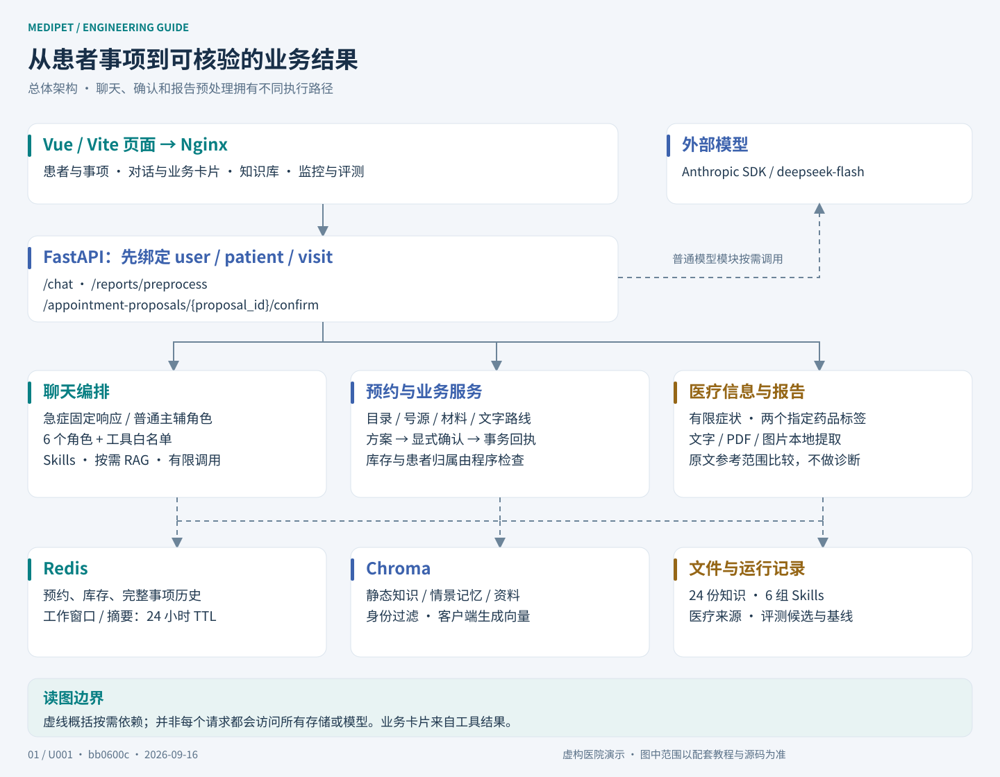
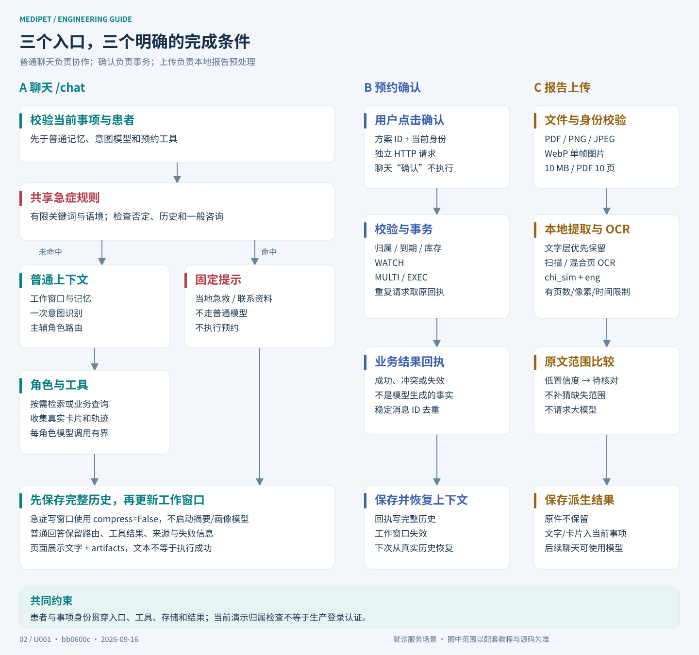
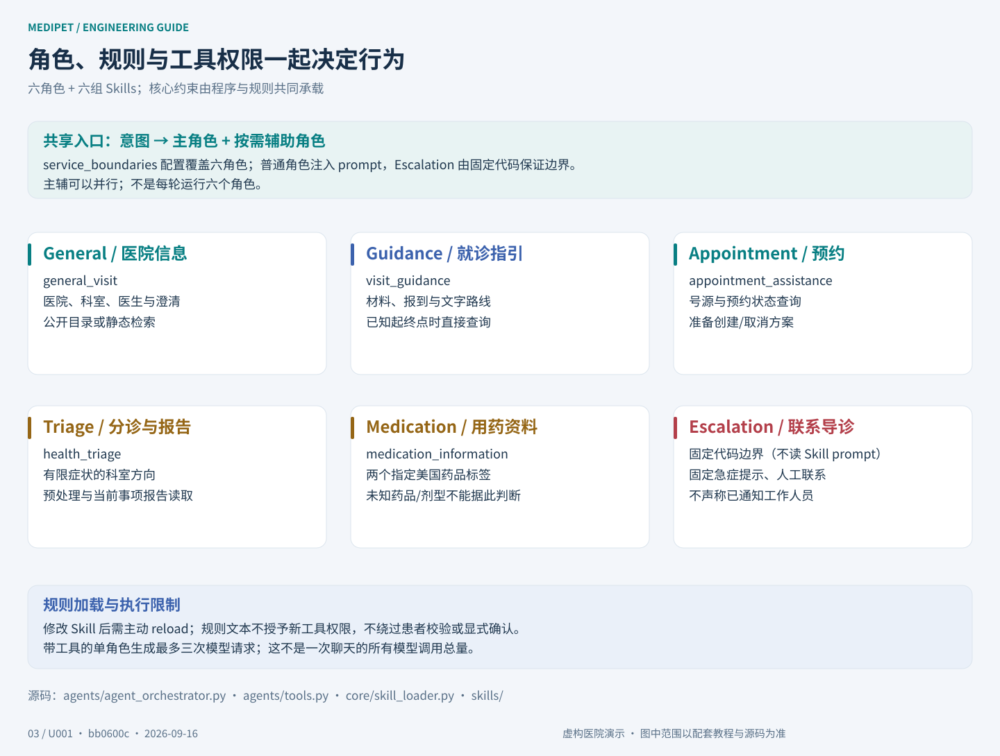
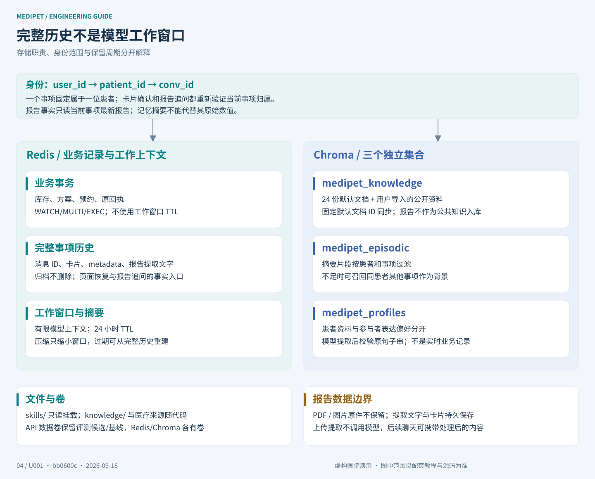
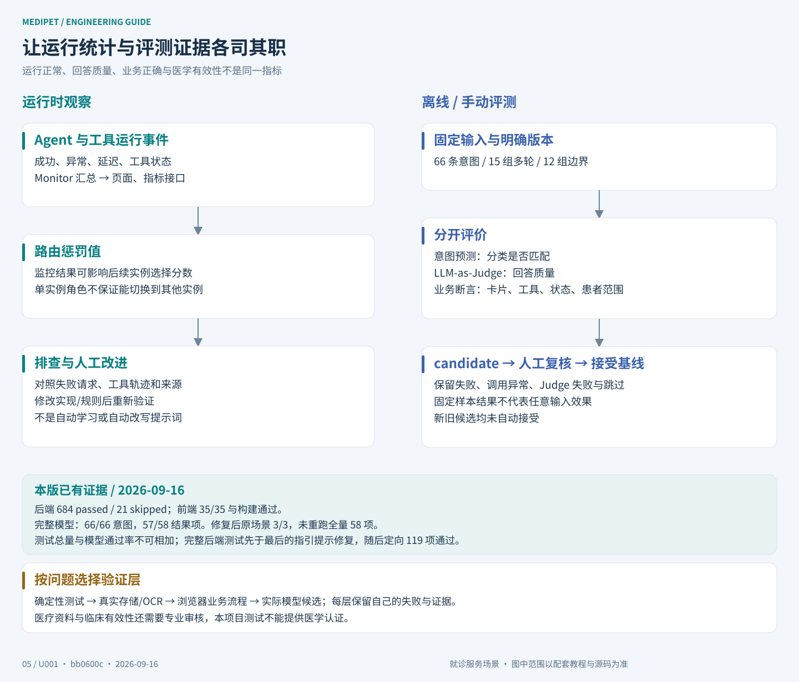
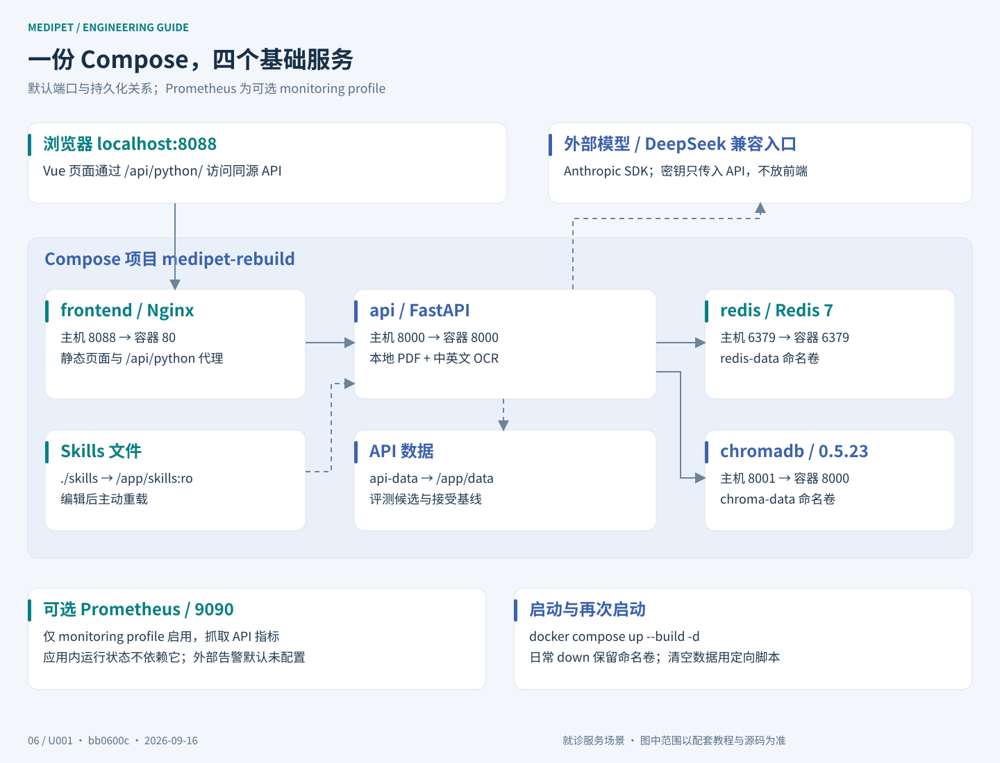

# MediPet 项目架构图

本文档展示 MediPet 的核心架构图。图片均位于本目录的 `assets/architecture/`，可直接在 README 或项目展示材料中引用。以下保留总体、主链路、角色、存储、监控评测、部署的读图顺序，对照当前 `bb0600c` 源码。

当前架构重点体现：Docker Compose 一键部署、结构化多 Agent 路由、RAG 知识库、三级记忆、动态 Skills、监控和端到端评测；在这条主线上增加患者事项、预约事务、有限医疗信息和本地报告预处理。

## 1. 总体架构



说明：

- 用户从 Vue 页面发起请求，经 Nginx `/api/python` 同源代理转发到 MediPet 的 FastAPI 服务。
- 主服务提供 `/chat`、`/search`、`/skills`、`/eval/run`、`/monitor`、`/metrics`，以及患者事项、预约方案确认和报告上传接口。
- Redis 承担工作记忆、完整历史及预约状态，ChromaDB 承担 RAG 知识库、情景记忆和患者资料/参与者偏好。
- 外部大模型使用 Anthropic SDK 的 Messages 协议；当前验证配置为 DeepSeek 兼容入口的 `deepseek-flash`。

先看图中的三条业务路径：聊天负责理解、查资料和准备方案；用户点击确认后由服务执行预约事务；上传报告走本地文字提取与 OCR。三者的执行结果都需要患者和事项范围，不能把“模型回答成功”画成“业务已执行”。源码入口见 [api/main.py](../api/main.py)。

## 2. `/chat` 主链路架构



说明：

- `/chat` 先绑定患者事项，再检查共享急症规则。未命中时才读取 Redis 和 ChromaDB 中的上下文。
- 普通请求识别意图后进入编排，Agent 按需调用共享检索工具，才通过进程内 MCP 工具管理器执行查询改写、并行召回和结果重排。
- Orchestrator 根据意图、关键词和实体计算领域分数，生成包含主 Agent、辅助 Agent 和路由原因的 `RoutingDecision`。
- 普通 Agent 调用 LLM 前会通过 SkillManager 注入匹配的动态 Skills。
- 回复完成后，系统先保存完整历史，再写工作记忆，并为普通请求安排后台画像更新。

### 为什么把急症、确认和上传单独画出来

急症命中时返回固定提示，跳过普通分类与生成模型；仍保存历史和窗口，但 `compress=False` 防止压缩触发模型。它是有界演示规则，不是完整临床分诊。

预约方案只表示待确认。页面按钮调用 `/appointment-proposals/{proposal_id}/confirm`，由 [HospitalService](../hospital/service.py) 通过 `WATCH/MULTI/EXEC` 提交，重复确认取得原回执。

报告上传使用 [report_upload.py](../health/report_upload.py) 本地提取 PDF 文字、扫描/混合页及图片 OCR，不请求模型。混合页保留文字层并标记未核对的 OCR 补充；原件不保留，提取文字与卡片保存，后续聊天可将这些内容交给模型组织回答。

## 3. 多 Agent 与 Skills 注入关系



说明：

- 普通用户消息先经过 IntentRecognizer，再交给 AgentOrchestrator 生成结构化路由决策。
- General、Guidance、Appointment、Triage、Medication 分别负责医院信息、就诊指引、预约准备、有限症状/报告、指定药品资料；Escalation 返回固定急症提示或人工联系资料。
- 复合问题会形成 `primary_agent + supporting_agents`，并行处理后按主处理和辅助处理合并回复。
- 普通角色按范围加载相应 Skills：
  - general_visit：医院信息接待规范
  - visit_guidance、appointment_assistance：就诊指引与预约协助
  - health_triage、medication_information：分诊/报告与指定药品资料
  - service_boundaries：共同服务边界，配置覆盖六角色
- Skills 根据 `agents` 和 `keywords` 匹配，避免不同领域规则互相污染。

Escalation 的 `handle` 直接生成固定内容，不读取 Skill prompt；修改规则并 reload 不会改变它的固定回复。普通角色的规则重载也不改变工具权限。单角色工具循环最多请求模型三次，分类、其他角色、RAG、整合和记忆调用另计。详见[重点代码](重点代码.md)与 [Skills 说明](../skills/README.md)。

## 4. 数据与存储架构



说明：

- Redis 保存当前事项最近消息和短期工作记忆，也独立保存完整历史、号源、方案、预约与原回执。
- ChromaDB 包含三个核心 collection：
  - `medipet_knowledge`：RAG 知识库
  - `medipet_episodic`：按患者事项过滤的历史摘要
  - `medipet_profiles`：患者资料与参与者表达偏好
- `skills/*/SKILL.md` 是可主动重载的场景规范，共六组。
- `/app/data/eval/candidates/` 保存评测候选，显式接受后的报告保存到 `/app/data/eval/baseline.json`；它们位于 API 命名卷。

工作窗口与摘要有 24 小时 TTL，压缩和过期不会删除完整事项历史。报告追问从当前患者、当前事项读取最新报告，不能从其他事项或摘要补造数值。知识库默认 24 份文档按固定 ID 更新并保留独立上传；知识向量由Chroma客户端默认模型生成，与意图本地BGE语义主后端/hash后备分开。意图provider只共享模型编码，分类缓存与`learn`模板属于各实例；模型资产位于/opt/medipet/models/intent，不混入Chroma集合或被/app/data卷遮住。观察步骤见[完整使用指南](完整使用指南.md)的存储与压缩章节。

## 5. 监控与评测闭环



说明：

- `/monitor` 读取 Agent 和工具统计，包括成功率、平均延迟和熔断状态。
- Monitor 会计算 `monitor_penalty`，写回 Orchestrator，影响后续同类实例选择分数；默认每类一个实例，不能据此断言已切到另一健康节点。
- `/eval/run` 会真实调用 Orchestrator 生成回复，再用 LLM-as-Judge 评分。
- 评测输出通过率、分数、回归问题和优化建议。

评测另用业务断言核对库存、回执、患者范围、卡片和工具调用。每次结果先作为 `candidate` 保存，经人工复核接受后才是基线。U001 历史完整模型候选为 66/66 意图、57/58 结果项；修复后原两轮场景复测 3/3，未重跑全量。当时后端 684 passed/21 skipped、前端 35/35 属不同验证层次。U002 另有意图专项重放，融合持平且故障接受准确率未过门槛，不等于重新验收 HTTP 业务链路。详见[指标模板](带数据指标的加强版简历模板.md)和[验收汇总](../docs/internal/updates/U001-health-consultation/evidence/acceptance.md)。

## 6. 一键部署结构



说明：

- 按使用指南准备本地配置并启动 Docker 后，用一条命令启动服务栈：

```bash
docker compose up -d --build
```

- 默认 Compose 会启动：
  - `api`：FastAPI，宿主机 8000，镜像包含本地 OCR
  - `redis`：Redis，宿主机 6379
  - `chromadb`：Chroma，宿主机 8001，对内 8000
  - `frontend`：Vue 静态页面与 Nginx，宿主机 8088
- `prometheus` 是可选 `monitoring` profile，启用后宿主机 9090；应用内监控不依赖它。
- `./skills` 只读挂载到 API，修改后主动 reload。Redis、Chroma、API 数据使用命名卷；普通 `docker compose down` 保留卷，评测报告不对应宿主机 `./data/eval`。

配置和网络细节见 [docker-compose.yml](../docker-compose.yml)、[Nginx 配置](../frontend/nginx.conf)及[完整使用指南](完整使用指南.md)。如需快速介绍项目，可使用[总览海报](assets/posters/medipet-overview-poster.svg)。
